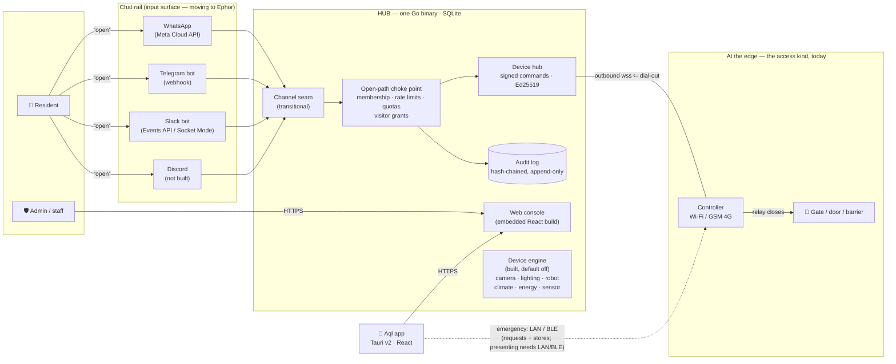
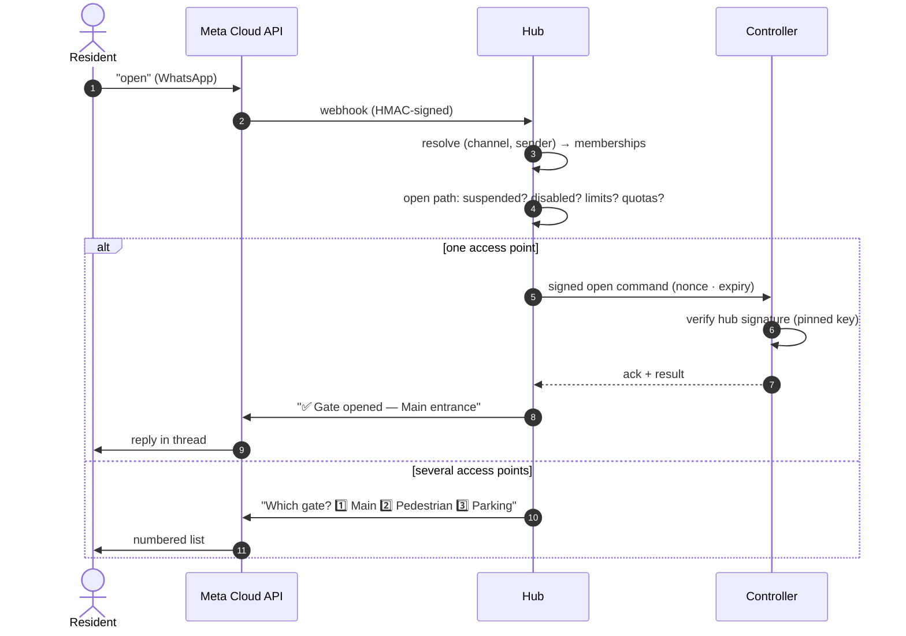

<!-- no-broker-dep:allow-file: names Ephor several times describing the chat-rail migration
     ("in transition. Moving out of Aql into Ephor" — an honest, in-progress design decision,
     not a completed one) — the adapters it names are still implemented and running inside
     hub/internal/channels/ today. Architecture prose, not a build or startup path; C-DEP's Go
     closures across hub/e2e/jcs/controller are clean. -->

# Aql architecture

> **An open-source command centre for the physical world.** One hub you run yourself,
> meant to own everything physical around a home or a business — cameras, lighting,
> robots, climate, energy, sensors and access — with chat and a console as input surfaces
> onto it. **Access** (gates, doors and barriers) is the kind built furthest, and it is the
> only one taken all the way down to a device agent that verifies an Ed25519 signature
> instead of trusting its network, with a versioned wire contract and conformance vectors
> behind it. The other six share the engine, the capability catalogue and the console:
> lighting, climate, energy and sensors are driven through MQTT, Modbus TCP or generic HTTP;
> cameras record, retain and play back. Robots are the one kind with no driver of their own,
> though the generic ones reach them. What none of the six has is a purpose-built agent —
> they are driven through third-party protocols, and no camera driver has met a camera.

Aql has no cloud. It is just the **system**: a hub you run, devices at the edge that
verify rather than trust, an app in your pocket — every line open source, nothing hosted
by us. [vulos.org/projects/aql](https://vulos.org/projects/aql) is the project site (docs +
downloads), not a service. There is **no billing system** — nothing in the binaries
charges anyone anything — **no account** with us, and **no telemetry**.

This document is the canonical long-form architecture. It states plainly which parts
exist and which are design intent. The condensed operator-facing tour is
[`site/docs/architecture.md`](site/docs/architecture.md).

---

## 0. Built vs. designed, in one table

| Layer | Status |
| --- | --- |
| Hub (`hub/`) — open path, console, API, device hub, audit | **Built.** 136 HTTP routes, 1,392 Go test functions green across 20 packages |
| **Access module** — the first device kind wired end to end | **Built.** Signed commands, pinned-key controller, offline grants, tamper-evident audit |
| Controller agent (`controller/`) — pairing, signed commands, grants, events | **Built.** 192 Go test functions green. GPIO relay driver and BLE radio are **not** |
| Wire contracts (`proto/`) | **Built.** 83 conformance vectors, 118 checks, consumed by both sides |
| Cross-module harness (`e2e/`) | **Built.** Boots real binaries and drives the open path over the wire |
| Web console + desktop shell (`src/`, `src-tauri/`) | **Built.** Admin surfaces, the device / energy / automations screens over the real engine, and an emergency-access screen that requests and stores an offline grant |
| **Device engine** — drivers, discovery, telemetry, automations, energy | **Built, default off.** Registry behind a driver seam; `http`, `modbus` (TCP), `mqtt`, `camera` (ONVIF) and `access` (gates, read-only) drivers; automations and energy on top. No radio in the hub — Zigbee and Z-Wave arrive over a bridge. No Matter and no dedicated robot driver; the camera driver records and plays back but has never received a frame from real hardware |
| **Phone-side offline grants** | **Half built.** The console requests and stores a grant (proven end to end against a real hub); *presenting* one still needs the LAN or BLE, which a browser tab cannot do |
| Chat rail | **In transition.** Moving out of Aql into [Ephor](https://github.com/vul-os/ephor); the adapters in `hub/internal/channels/` are transitional (§3a) |
| Google OAuth | **Not built** |

### The seven device kinds

Aql's device model has seven kinds — **camera, lighting, robot, climate, energy, sensor,
access**. Five of them can be populated from real hardware today through the engine (§8),
by whichever driver fits: MQTT, Modbus TCP, generic HTTP, or ONVIF for cameras. **Robot**
is the one kind with no DEDICATED driver — a mower or bot with an HTTP API or an MQTT topic
is drivable today as kind `robot` with `robot.job`/`robot.blade-job` and one action per
verb, and `TierHazardousMotion` survives that route (tested in `devices/httpdev`). What is
missing is vendor integration — a mower's own protocol, docking, scheduling — and no robot
has been driven. **Camera** records, retains and plays back, and has never met hardware.

**Access** is the exception in the other direction: it is the most complete kind and the
only one that does not go through the engine. It has a real wire contract, a real device
agent and a real audit trail, and it remains the reference shape — bringing it onto the
same internal model is still ahead.

---

## 1. The system at a glance



Everything server-side is **one binary**. The hub owns state, decides, signs, and holds the
audit log; it serves the console and the app's API, and pushes signed commands to devices.
Devices at the edge verify what the hub sends rather than trusting the network they sit on.
Controllers dial **out**, so they work behind NAT and on CGNAT'd 4G SIMs with zero inbound
ports.

---

## 2. Components

| Component | What it is | Runs on | Stack |
| --- | --- | --- | --- |
| **the hub** (`hub/`) | The entire server: open path, console, API, device hub, audit — not a KOTVA gateway (§3a) | Any VPS / Pi / always-on box | Go · SQLite (`modernc.org/sqlite`, no CGO) · `go:embed` console |
| **controller** | The unit wired to the gate relay; verifies signatures, drives the motor. The agent is real and conformance-tested; the GPIO relay and BLE radio are the hardware-only surfaces still missing | Pi-class board at the gate, Wi-Fi or GSM | Go, own module, std-lib first (`-tags gpio` / `-tags ble` for hardware) |
| **e2e** | Cross-module harness: boots real hub + controller binaries and proves the open path over the wire | CI, dev machine | Go, subprocess-driven |
| **src / src-tauri** | The console (embedded in the hub) and the Tauri v2 desktop shell with a hub picker | Browser, desktop | React 19 · Vite · Tauri v2 · Rust (thin) |
| **e2e-browser** | Playwright suite that drives the real hub binary with the embedded console | CI | TypeScript |
| **site** | Static mini-site: landing + a self-contained docs viewer over `site/docs/` | Any static host | Hand-written HTML + markdown |
| **proto** | The versioned wire contracts and conformance vectors (§7) | — | Markdown + JSON |

### Repo layout

```
aql/
├── hub/          # 🟢 the hub: Go, the whole product server (auth, open path, device hub, admin)
│                 #    …plus channels/, the transitional chat adapters moving to Ephor (§3a)
│   └── migrations/   # SQLite schema, clean folded baseline (33 migrations, 58 tables)
├── controller/   # 🟢 reference gate device agent (own Go module); GPIO/BLE need real hardware
├── e2e/          # 🟢 cross-module suite, real hub + controller binaries over the wire
├── proto/        # 🟢 pairing · commands · grants · events contracts (+ vectors/ fixtures)
├── src/          # 🟢 console + landing — React 19 · Vite (wrapped by src-tauri/ for desktop)
├── src-tauri/    # 🟢 Tauri v2 desktop shell — hub picker, native HTTP plugin, one IPC command
├── e2e-browser/  # 🟢 Playwright against the real embedded-console binary
├── site/         # 🟢 static mini-site — index.html + docs.html + site/docs/*.md
├── docs/         # 🟢 deep engineering reference (threat model, KOTVA alignment, design system)
├── scripts/      # 🟢 screenshotter + docs-vs-code feature-claim guard
└── (device engine)   # 🟢 built, default off — `hub/internal/devices/`, see §8
```

**There is no `backend/`.** A Cloudflare Workers + Postgres backend was the behavioural
reference the Go hub was ported from; it has been deleted. Any comment or doc still
referring to it is stale.

---

## 3. Input surfaces, and the three ways to reach a gate

An input surface is anything that turns a human intention into an intent the hub can act
on. There are three: chat, the app, and the web console. None of them is access-specific by
design — the seam behind each is device-agnostic — but access is the only device kind
behind them today, so in practice all three are described here in terms of opening a gate.

### 3a. Chat — the primary path, and a rail in transition

The hub exposes a **channel seam**: a small interface that resolves a sender to an
identity, turns a message into an intent, and sends replies. Everything behind the seam
is channel-agnostic — a channel decides how to ask and how to reply, never whether the
gate may open.

> **Where this is going: [Ephor](https://github.com/vul-os/ephor).** The adapters that
> terminate WhatsApp, Slack and Telegram are being lifted out of Aql and into Ephor, the
> coordinator implementation in the KOTVA family — the component whose job is bridging
> legacy rails. In the target shape a resident texts a channel, Ephor terminates the rail
> and hands the hub an authorised command, and the hub does what only it can do: check the
> rules, sign it, actuate. Ephor is separate and swappable — run your own or point at one.
>
> **That move is in progress.** Texting a gate open works today, but the adapter code in
> `hub/internal/channels/` is transitional and is not the long-term answer, and the
> Ephor-backed path is not shipped either. Note also the naming: **Aql's hub is not a KOTVA
> gateway.** It bridges chat rails into its own local domain; the gateway/coordinator role
> in that family is Ephor's — which is exactly why this component's own directory
> (`hub/`), Go module (`github.com/vul-os/aql/hub`) and binary (`aql-hub`) are named for
> what it is, a hub, rather than for a role that belongs to a different product. See
> [`docs/KOTVA-ALIGNMENT.md`](docs/KOTVA-ALIGNMENT.md).

| Channel | Identity | Transport | Today |
| --- | --- | --- | --- |
| **WhatsApp** | phone number | Meta Cloud API webhook (HMAC-verified) | Works — transitional. High friction: needs a verified WABA |
| **Slack** | member id | Events API webhook (signed requests, 300 s replay window) **or** Socket Mode (outbound WSS, zero ingress) | Works — transitional. Both modes |
| **Telegram** | chat id | Webhook, secret-token header verified | Works — transitional. Long-polling is roadmap |
| **Discord** | user id | — | **Not built.** No code |
| **DMTAP** | keypair / `name@domain` | — | **Not built.** A `DialChannel` scaffold exists; its only transport implementation fails closed |

Memberships are keyed on `(channel, external_id)`, not phone-number-only, so one person
can be reachable on several channels.

The intent vocabulary the seam resolves is `open`, `close` and picker replies — because
that is the only thing there is to command. Extending it to "turn the lights off" is a
small change *at the seam* and a large change *behind it*: §8 has to exist first.

> **The chat rail is not private.** Meta, Slack and Telegram see the plaintext of every
> message — the hub must read it to act on it. This is the largest privacy exposure in the
> system and it is stated up front in [`docs/THREAT-MODEL.md`](docs/THREAT-MODEL.md).

An opt-in WhatsApp **bridge engine** (Evolution API / Baileys) exists in code as an escape
hatch for operators who cannot complete Meta's business verification. It is off by
default, fails closed toward the official Cloud API, logs a ban-risk warning on every
boot, and **violates KOTVA §26.8.2's unconditional MUST NOT on unofficial WhatsApp client
libraries**. It is documented rather than hidden; it is not recommended. See
[`docs/KOTVA-ALIGNMENT.md`](docs/KOTVA-ALIGNMENT.md).

Whichever component terminates the rail, the exposure is the same: **Meta, Slack and
Telegram see the plaintext of every message**, because something has to read it to act on
it. Moving the rail to Ephor relocates *where* the plaintext is handled; it does not remove
a third party from the loop. The web console path has no chat platform in it at all.



### 3b. The app — emergency access + admin

The Tauri app is deliberately **not** the daily driver. It exists for two jobs: the admin
console, and opening the gate **when everything else is down**.

The design: the hub periodically issues each app user an **offline-verifiable grant** — a
short-lived signed statement of their rights (locations, access points, expiry, an
optional weekly window) bound to the app's own keypair. Near the gate, the app finds the
controller directly (mDNS on the same LAN, or BLE) and proves itself with a
challenge-response. No internet, no hub, no chat platform.

**Status: three pieces of four.** The wire contract, the controller-side verification
(11 normative steps, conformance-tested) and the hub's issuance endpoint
(`POST /v1/offline-grants`) are all real. **The app side — requesting, storing and
presenting a grant — is not built**, so this path does not run end to end for a real
resident today. See [`site/docs/emergency-access.md`](site/docs/emergency-access.md).

Grant issuance re-checks the same membership / account-suspended / user-disabled gates as
a live open, is all-or-nothing across the requested access points, has a fixed 7-day TTL
that callers cannot extend, and is written to the admin audit trail. It deliberately does
**not** check a controller's lockdown state — lockdown is controller-local, and it is
enforced unmodified at redemption time, which is the freshest possible signal. There is
**no grant revocation channel**: revocation converges at grant expiry. That is an accepted
v0 non-goal, stated in the code.

### 3c. Web console — the fallback

Unlimited access through the hub's own console, always. Quota warnings in chat point
here. This is also the path with no chat platform in the loop.

---

## 4. Running a hub — the WABA insight, reachability, and money

Webhooks are easy; **the WhatsApp number is hard**. A WhatsApp channel needs a verified
Meta Business portfolio + WABA + phone number. Every hub operator brings their own — Aql
is never in the loop, and Meta bills the operator directly.

**Reachability is kept deliberately simple.** The hub binds a listener and serves **plain
HTTP, full stop** — no TLS/ACME code, no tunnel protocol, no relay dependency. TLS is
entirely the operator's job. This is not merely advised, it is **enforced**: the hub
refuses to start if `-listen` resolves to a non-loopback address unless `-behind-proxy`
(env `AQL_BEHIND_PROXY`) is set. The check is address-resolution-aware, not a string
match.

1. **Direct** — a VPS or public IP behind your own reverse proxy (Caddy, nginx, Traefik).
2. **Any tunnel you already trust** — cloudflared, Tailscale Funnel, ngrok, or a
   self-hosted `vulos-relayd` (open source, no account needed). These terminate TLS at
   their own edge and hand the hub plain HTTP. A tunnel in raw TCP/SNI-passthrough mode
   does not work directly — put a reverse proxy behind it. The hosted **Ephor** is the
   same tunnel model as a convenience, never a requirement.
3. **Zero-infrastructure mode** — real today. Controllers dial out unconditionally, and
   the Slack rail can dial out too (Socket Mode: set an app-level token and the connection
   is a single outbound WebSocket, no inbound port or URL needed). A hub on a LAN Pi with
   no public URL already does chat + LAN console + controllers end to end. Only the
   WhatsApp and Telegram webhooks and remote app access need a public URL. Which component
   holds that outbound socket is exactly what §3a's move to Ephor is about.

Full breakdown: [`site/docs/ingress.md`](site/docs/ingress.md).

**Money is out of scope.** There is no billing code anywhere. An operator who wants to
charge their residents does it outside Aql.

---

## 5. What "decentralized" means here

Not federation. Not P2P. **Many independent hubs, each a full authority** over its own
tenants, devices and audit log — with zero coordination between them.

- The app asks "which hub?" on first run.
- A controller pairs with exactly one hub and **pins its signing key** — a hostile
  network, DNS hijack, or malicious tunnel cannot forge an open.

Each hub is itself genuinely multi-tenant: accounts, locations, access points, members
with roles, and an instance-admin seat above every account. Isolation is app-layer org
scoping applied on every query, including the rate-limit and quota counters.

---

## 6. Security model

| Layer | Mechanism |
| --- | --- |
| Command integrity | Ed25519-signed commands: nonce + expiry; the controller pins the hub key at pairing |
| Pairing | Claim-token flow (admin creates claim → device redeems once → keys exchanged). After redemption only a `repair` command signed by the pinned key, or a physical factory reset, can change the pinned key |
| Emergency grants | Short-TTL signed capability bound to app keypair; nonce challenge-response; controller-side verification in a fixed 11-step fail-closed order |
| Channel ingress | Per-channel verification (Meta HMAC, Slack signed-request scheme + replay window, Telegram secret-token header) — **fail closed** |
| Tenancy | App-layer org scoping on every SQLite query, counters included |
| Transport | Plain HTTP; TLS comes from a reverse proxy or TLS-terminating tunnel. The binary refuses a non-loopback bind without `-behind-proxy` |
| Audit | Hash-chained, append-only event log with DB triggers; verifiable live or against a cold backup. **Detection, not prevention** — see §6a |
| Login | Per-IP and per-account brute-force throttles, fail-closed; live per-request session revocation; log-out-everywhere |
| Abuse limits | Open cooldown, hourly and daily caps, optional per-location quotas at one choke point; denials audited, chat replies honest |
| Instance admin | Operator seat via one-time claim; constant-time token check; atomic under concurrency; every attempt audited; cannot disable self or the last admin |

### 6a. The two deliberate asymmetries

Both are stated in code, and both are load-bearing:

- **The open-path rate limiter fails *open*.** If the counter store errors, the open is
  allowed and the audit row is tagged `rate_limit_check_failed`. A gate is physical
  access; locking residents out because a bookkeeping table hiccuped is the worse
  failure. Availability wins for enforcement; visibility is preserved.
- **Everything else fails *closed*.** Webhook signatures, auth throttles, membership
  checks, grant verification, command verification. A forged command is worse than a
  missed rate limit.

And the audit chain's honest ceiling: it makes tampering *detectable*, not impossible. An
attacker with filesystem access who edits a row and recomputes every downstream hash
leaves a clean-looking chain. The test suite proves that boundary directly.

---

## 7. The contracts that must not break (`proto/`)

Deployed hardware is forever. These wire contracts are versioned from day one because
they are painful to retrofit:

1. **Pairing** — claim token redemption, key exchange, hub-key pinning
2. **Signed commands** — open/close, nonce + expiry semantics
3. **Offline grants** — grant format, challenge-response, window evaluation, revocation
   semantics
4. **Controller events** — upstream: button pressed, gate held open, tamper

Backed by **83 conformance vectors** across seven fixture files, and a `verify.mjs`
self-checker that independently re-canonicalizes, re-signs and re-evaluates each one —
**118 checks**, because multi-step transcripts contribute more than one. Both the hub and
the controller consume these fixtures in their own test suites. Binaries can churn; these
can only be extended.

The same reasoning is why the environment variables were renamed `LINTEL_*` → `AQL_*`
without dropping the old ones: an unset `AQL_*` variable falls back to its `LINTEL_*`
predecessor and logs a warning naming both (`hub/cmd/hub/env.go`), so an existing
deployment upgrades without its configuration silently going dark. The `lintel.db`
filename and the controller's `_lintel._tcp` mDNS service went the other way and kept
their pre-merge names outright, no fallback involved: they are a deployment and wire
contract for hubs and controllers already in the field.

---

## 8. The device engine

"One hub owns everything" — cameras, lighting, robots, climate, energy, sensors, alongside
the access control that already works — rests on a device engine. That engine now exists
in `hub/internal/devices`: a registry behind a driver seam, with a capability catalogue
that decides what a device may be asked to do.

**It is off by default, and constructs nothing until asked.** A hub started without
`-device-drivers` builds no registry, starts no poller and opens no socket. That is not a
safety afterthought — it is asserted by a test (`hub/cmd/hub/wiring_default_off_test.go`)
that fails if a registry is ever built without one.

Four drivers ship: generic HTTP/webhook, Modbus TCP (read-only), MQTT (including a
zigbee2mqtt bridge scan), and ONVIF cameras. An automations runtime
(`trigger → condition → action`, §9) and energy ingestion sit on the same device state.

**What is not built, stated as plainly as the rest.** No Matter. No radio in the hub —
Zigbee and Z-Wave are reached through a `zigbee2mqtt` or `zwave-js-ui` bridge that owns
the radio and republishes to MQTT, which is a deliberate choice rather than a gap. No
dedicated robot driver — the kind is reachable through the generic ones, but nothing
speaks a mower's own protocol. No robot hardware has been driven. And the camera pipeline,
which is built end to end — RTSP media, depacketization, muxing, recording, retention,
`camera:view` and live view — has never received a frame from a camera: every test drives
an in-process RTSP server, Chromium accepts the container without decoding a picture, and
the retention arithmetic deletes real files under rules nobody has exercised on real
footage.

**Access is the shape to copy, not the exception to it.** The access module already proves
the parts that are hard to retrofit: a versioned wire contract with conformance vectors, a
device that verifies a signature instead of trusting its network, and an audit row written
in the same transaction as the decision. ACTUATION still runs as its own stack, deliberately
and permanently (docs/ACCESS-ON-THE-ENGINE.md §3.1); what has changed is that gates now
APPEAR in the engine's fleet, read-only, via the `access` driver. Moving the opening itself
onto the device model — so `access` is one kind among seven in every sense — is the part of
this phase that has not happened.

**Where it lives: the Go hub.** It owns persistence, audit and the open path, and it runs
on the always-on box. The Rust core in `src-tauri/` was the alternative and is not it; it
exposes one IPC command (`system_pulse`, host telemetry) that the frontend does not call.

Full detail, including what "works with any hardware" does and does not mean:
[`site/docs/devices.md`](site/docs/devices.md).

---

## 9. Feature notes and known gaps

**Shipped and worth knowing about:**

- **Visitor / temporary access grants** — a phone number gets access to named access
  points for a dated window, with an optional use cap, revocable, and **refunded** if the
  open is then denied by a rate limit or quota. The "contractor for one Saturday" case.
- **Runtime rate-limit overrides** — the operator can retune the four abuse limits without
  a restart; resolution is *runtime override → env var → built-in default*, and
  `GET /admin/limits` shows all four layers side by side.
- **`aql-hub verify-audit`** — walks both audit chains against a cold backup without
  booting the HTTP server.
- **Outbound webhooks and scoped API tokens** — `…/webhooks` and `…/api-tokens`,
  admin-only. Webhook deliveries are HMAC-SHA256 signed over `timestamp.body` and the
  target is re-validated against a fresh DNS resolution before every attempt; the wire
  format is specified in [`proto/WEBHOOK-PROFILE.md`](proto/WEBHOOK-PROFILE.md) with
  vectors. Integrations no longer have to authenticate as a user.
- **Geofences, online time-window rules, analytics and the per-access-point maintenance
  log** — `…/geofences`, `…/time-windows`, `/v1/analytics/…`,
  `/v1/access-points/{id}/maintenance`. Each of these was listed as unbuilt here for
  longer than it was actually unbuilt.

**Not built, stated plainly:**

- **No Google OAuth and no email verification.** The console has a Google button and an
  `/auth/callback` route; the hub serves neither. Password *reset* does ship
  (`POST /v1/auth/forgot-password`, `POST /v1/auth/reset-password`).
- **A sole instance-admin who loses BOTH their password and their recovery codes** has no
  in-band route back in. 2FA itself ships (TOTP, opt-in per user, ten single-use recovery
  codes shown once at activation), and the last resort on a self-hosted box is a SQL
  update against `lintel.db` with the server stopped — a strictly higher bar than the
  login it protects. Losing console access never locks anyone out of a *building*:
  controllers hold their own pinned keys and offline grants exist for exactly this.

The console↔hub drift above is at least mechanically tracked: `src/lib/__tests__/
routeParity.test.ts` diffs every frontend call against the hub's real registered routes
(extracted by `go run ./cmd/routegen`, AST-based) and lists the known-unavailable set
explicitly. `npm run check:claims` does the same job for documentation claims.

---

## 10. Tech decisions

| Decision | Choice | Why |
| --- | --- | --- |
| Hub language | **Go** | Single small static binary, ARM-friendly, `go:embed` console |
| Database | **SQLite** (pure-Go driver) | Zero-dependency self-hosting; one file to back up; `CGO_ENABLED=0` cross-compiles to a Pi |
| Console | **React 19 + Vite** | One build serves both the hub-embedded console and the Tauri shell |
| Desktop | **Tauri v2** | Desktop from one codebase; a native HTTP plugin so the console can reach any hub without needing that hub's CORS allowlist |
| Rust core | **Deliberately thin** | One IPC command today. The device engine may grow here; it has not started |
| Controller deps | **Std-lib first** | The WebSocket client and the mDNS responder are hand-rolled to keep the gate agent dependency-free; BLE is the one exception |
| Billing | **None** | Out of scope by design |
| License | **MIT OR Apache-2.0** | The whole system is open — there is nothing else |
