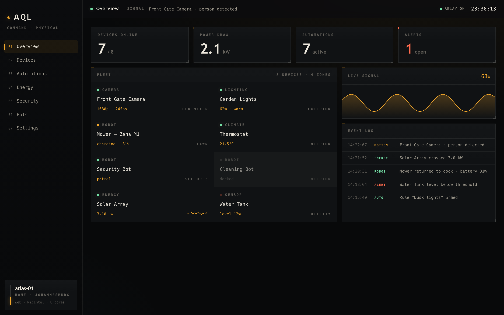
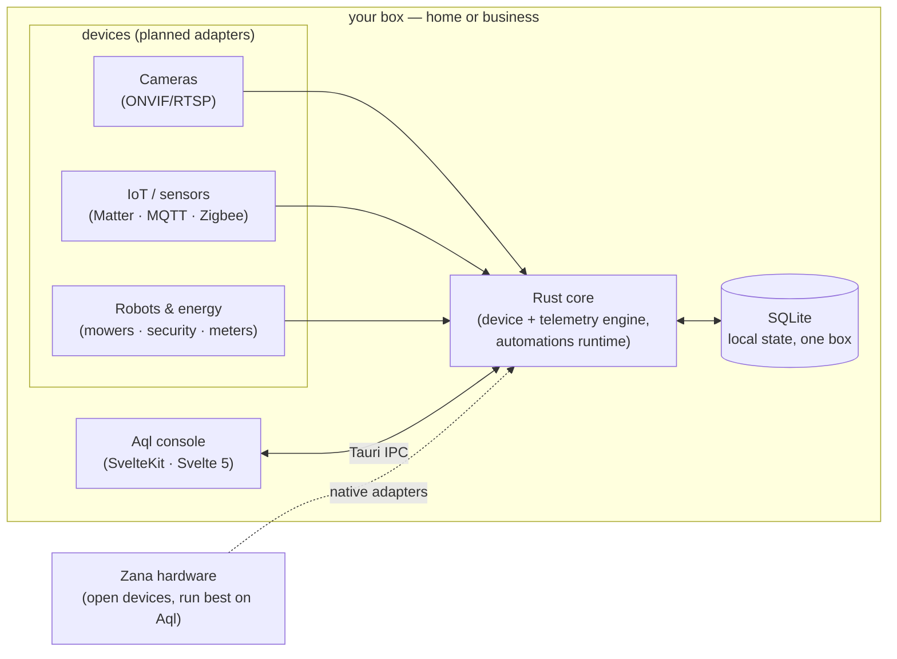

<p align="center">
  <picture>
    <source media="(prefers-color-scheme: dark)" srcset="assets/brand/logo-wordmark-dark.svg">
    
  </picture>
</p>

<p align="center"><strong>An open-source command center for the physical world. One hub owns everything.</strong></p>

<p align="center">
  <a href="#what-is-aql">What</a> ·
  <a href="#screenshots">Screenshots</a> ·
  <a href="#quick-start">Quick start</a> ·
  <a href="#how-it-works">How it works</a> ·
  <a href="#documentation">Docs</a> ·
  <a href="ROADMAP.md">Roadmap</a>
</p>

<!-- Plain-text badges on purpose: rendering this README triggers no external
     image fetches — same no-network-by-default ethos as the app. -->
<p align="center"><sub><a href="LICENSE">MIT</a> · Tauri 2 · SvelteKit + Svelte 5 · Rust · desktop · mobile · PWA · local-first</sub></p>

<p align="center">
  
  <br>
  <sub><em>The Overview console — devices online, power draw, live signal, and the fleet at a glance. All screenshots show demo data (<a href="docs/SCREENSHOTS.md">full tour</a>).</em></sub>
</p>

<table align="center">
  <tr>
    <td align="center" width="33%"><strong>One hub, everything</strong><br><sub>Cameras, lights, mowers, IoT sensors, energy, and security/cleaning bots — one control plane for your home or business.</sub></td>
    <td align="center" width="33%"><strong>You own the box</strong><br><sub>Runs on your own machine. No cloud broker, no account, no telemetry. It works offline and it answers to you.</sub></td>
    <td align="center" width="33%"><strong>Works with any hardware</strong><br><sub>Vendor-neutral by design — and paired with <a href="https://github.com/vul-os/zana">Zana</a>, an open-hardware line of devices built to run best on Aql.</sub></td>
  </tr>
</table>

## What is Aql?

**Aql** (Arabic عقل — *"the mind"*) is the software brain for your physical space. Plug in your cameras, lights, lawnmowers, IoT sensors, energy meters, and autonomous bots, and Aql becomes the single place you **see and control all of it** — with automations that span every device, whether you run a house or a whole facility.

Think of it as the reach of Home Assistant, pushed wider: not just consumer smart-home gadgets, but **autonomous robots and business fleets**, under **one hub that owns everything**. The app installs as a native desktop app, on your phone, or as a PWA — the same codebase, a tiny Rust core, and a fast Svelte console.

Its companion is **[Zana](https://github.com/vul-os/zana)** — an open-hardware line (robot mowers, sensor nodes, security & cleaning bots). Aql controls *any* device; Zana devices are designed to run best on Aql.

> [!NOTE]
> **Status: early — foundation + console.** What's shipped today is the Tauri + SvelteKit foundation and the operations-console UI running on a built-in **demo dataset** — the screens below are real and interactive, but the device-integration engine (drivers, persistence, automations runtime) is the next phase and **not built yet**. Honest, phase-by-phase status is in [ROADMAP.md](ROADMAP.md).

## Features

<table>
  <tr>
    <th align="left" width="50%">🛰️ Command surface <sub>(shipped UI, demo data)</sub></th>
    <th align="left" width="50%">⚙️ The engine <sub>(designed, next)</sub></th>
  </tr>
  <tr>
    <td valign="top">
      <ul>
        <li><strong>Overview</strong> — live readouts, the device fleet with breathing status, a live signal waveform, and an event log</li>
        <li><strong>Devices</strong> — every device with a detail panel: camera preview, status, quick controls</li>
        <li><strong>Energy</strong> — 24h power chart (draw vs solar), source mix, per-circuit consumption</li>
        <li><strong>Automations</strong> — rules as <em>when → do</em> flows with toggles and run counts</li>
        <li>Bundled offline fonts, a dark operations-console aesthetic, and a repeatable <code>npm run screenshot</code> pipeline</li>
      </ul>
    </td>
    <td valign="top">
      <ul>
        <li>A Rust device/telemetry engine behind a <strong>driver-adapter seam</strong> — planned: Matter, MQTT, Zigbee, ONVIF cameras, Modbus, generic HTTP/webhook</li>
        <li>Local persistence (SQLite) and a write-only <strong>OS-keychain credential vault</strong></li>
        <li>An automations runtime that spans every device</li>
        <li>Energy metering, security &amp; bot fleet modules</li>
        <li>LAN-first with explicit opt-in remote access; native mobile packaging</li>
      </ul>
    </td>
  </tr>
</table>

## Screenshots

The **shipped console**, dark theme, running on demo data. Full annotated tour: [docs/SCREENSHOTS.md](docs/SCREENSHOTS.md).

<table>
  <tr>
    <td width="50%"><br><sub><em>Overview — readouts, fleet grid, live signal, event log</em></sub></td>
    <td width="50%"><br><sub><em>Devices — list + detail panel with live camera preview and controls</em></sub></td>
  </tr>
  <tr>
    <td width="50%"><br><sub><em>Energy — 24h draw vs solar, source mix, per-circuit bars</em></sub></td>
    <td width="50%"><br><sub><em>Automations — when→do rules with toggles and run counts</em></sub></td>
  </tr>
</table>

## Quick start

```sh
git clone https://github.com/vul-os/aql
cd aql
pnpm install

pnpm tauri dev      # native desktop app, hot reload
pnpm dev            # frontend only — browser / PWA (uses the demo dataset)
pnpm run screenshot # regenerate docs/screenshots via Playwright
pnpm tauri build    # package installers
```

Prerequisites (Rust stable, Node 20+/pnpm, Tauri system deps) are in [docs/GETTING-STARTED.md](docs/GETTING-STARTED.md). The browser build needs no backend — it runs on the in-memory demo dataset.

## How it works

Everything runs on your box. Devices feed one Rust core; the core owns local state and speaks to the Svelte console over the Tauri IPC bridge. The same frontend ships as desktop, mobile, and PWA. The only network endpoints are the ones **you** add — your cameras, your sensors, your box. No cloud in the middle.



The engine layer is designed but not yet built — today the console runs on a demo dataset behind the same shapes. See [docs/ARCHITECTURE.md](docs/ARCHITECTURE.md) for the binding contract.

## Documentation

| Document | What it covers |
|---|---|
| [GETTING-STARTED.md](docs/GETTING-STARTED.md) | Prerequisites, clone, run on desktop / browser, build installers |
| [ARCHITECTURE.md](docs/ARCHITECTURE.md) | The intended architecture: Rust engine ↔ Svelte console, the driver-adapter seam, non-negotiables |
| [CONFIGURATION.md](docs/CONFIGURATION.md) | The local-first config &amp; state model |
| [THREAT-MODEL.md](docs/THREAT-MODEL.md) | Target security posture for a sovereign physical-world controller |
| [SCREENSHOTS.md](docs/SCREENSHOTS.md) | Annotated tour of every screen |
| [FAQ.md](docs/FAQ.md) | Straight answers — including how it differs from Home Assistant |

Also: [ROADMAP.md](ROADMAP.md) (honest, phase-by-phase).

## Development

```sh
pnpm install
pnpm check            # svelte-check
pnpm dev              # frontend (demo data) on :1420
pnpm tauri dev        # full app against the Rust core
pnpm run screenshot   # capture all views to docs/screenshots + assets/screens
```

The frontend is SvelteKit in SPA mode (adapter-static) so the same build serves desktop, mobile, and PWA. Fonts are bundled in `static/fonts` — the app makes no default network calls. Read [docs/ARCHITECTURE.md](docs/ARCHITECTURE.md) before changing anything structural.

## Ecosystem

Aql is one half of a pair:

- **Aql** — the brain (this repo): the software command center.
- **[Zana](https://github.com/vul-os/zana)** — the body: open-hardware designs for the devices Aql controls (robot mower, sensor nodes, security & cleaning bots).

## License

[MIT](LICENSE) — © VulOS. Aql is a VulOS project; source and issues at
[github.com/vul-os/aql](https://github.com/vul-os/aql).

---

<p align="center">
  <a href="https://vulos.org"></a><br>
  <sub><a href="https://vulos.org"><b>vulos</b></a> — open by design</sub>
</p>
