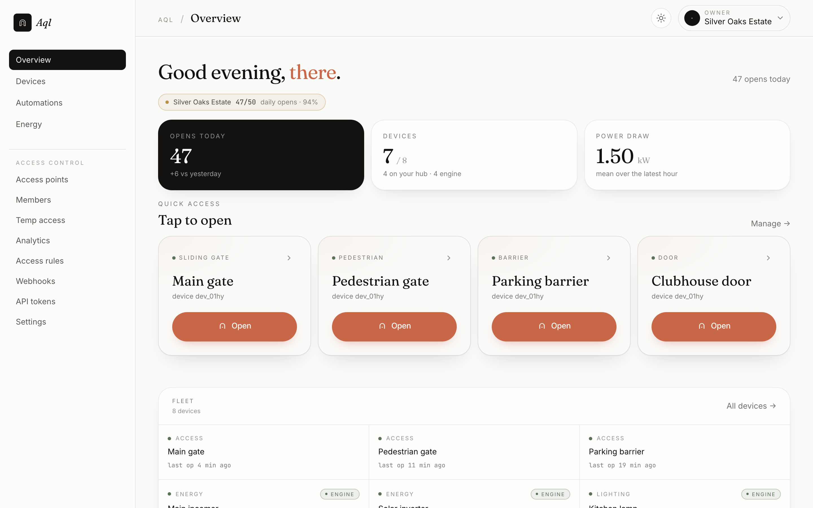
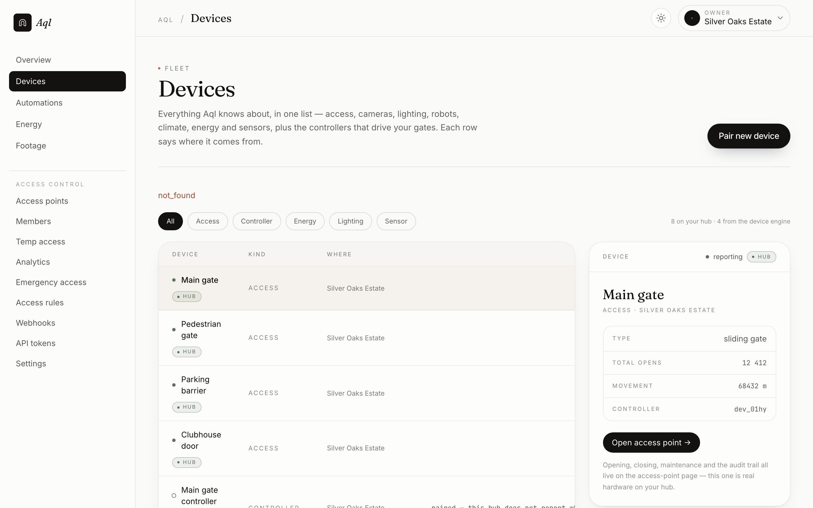
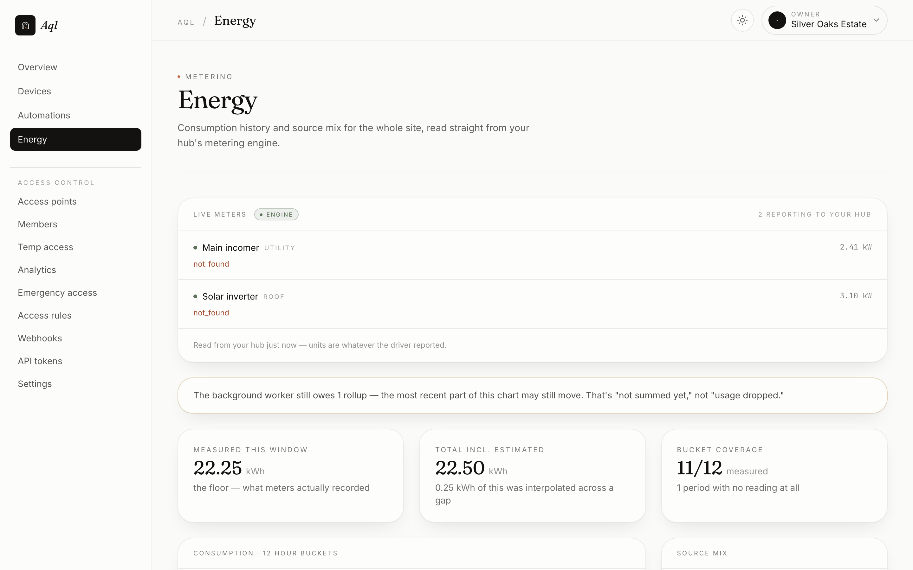
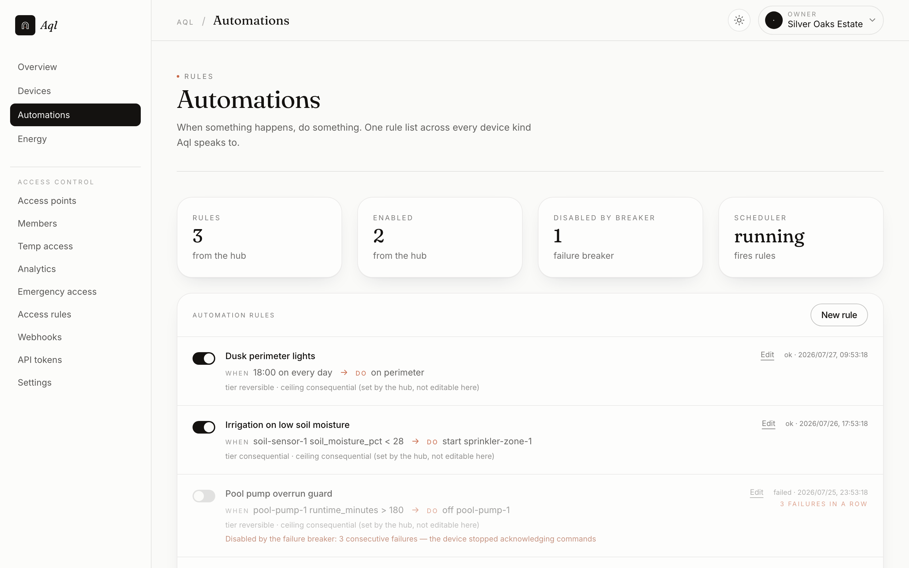
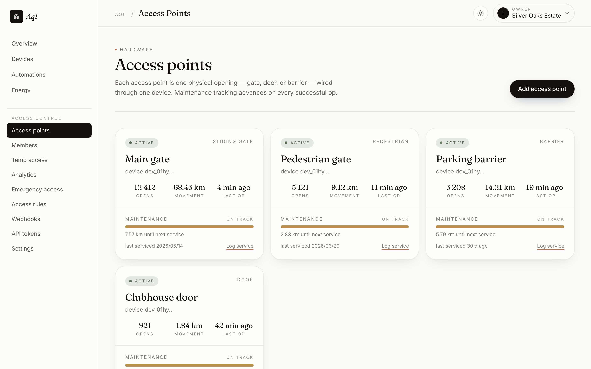
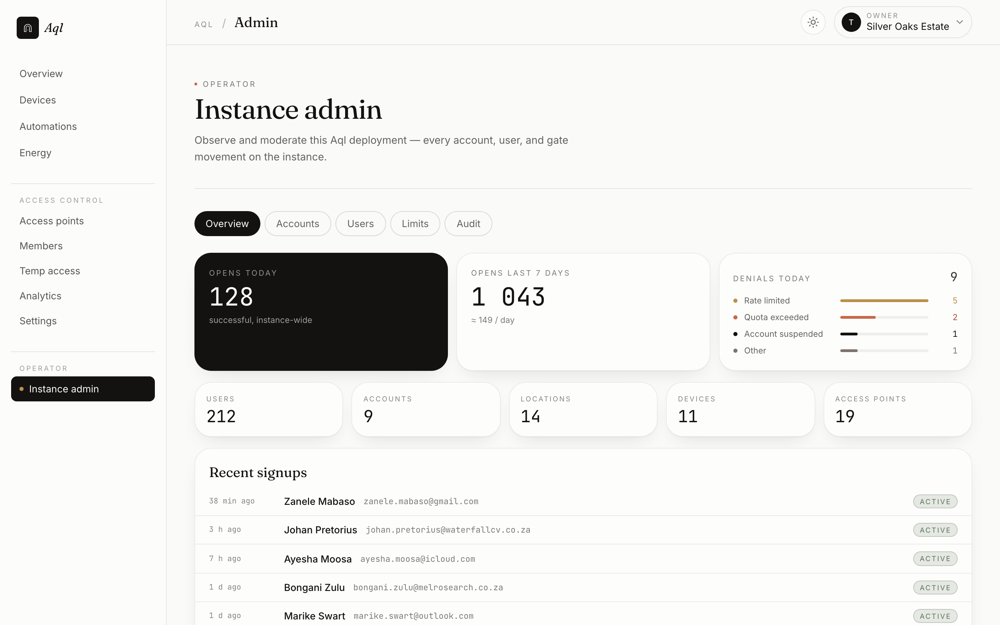
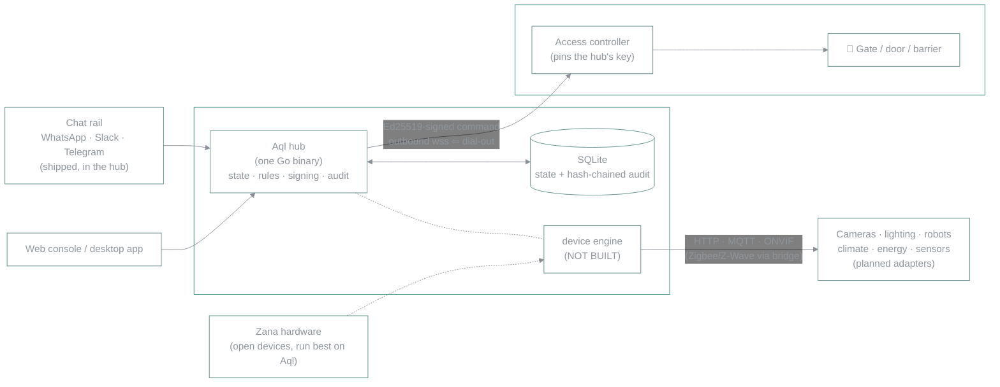

<p align="center">
  
</p>

<h1 align="center">Aql</h1>

<p align="center"><strong>An open-source command centre for the physical world. One hub owns everything.</strong></p>

<p align="center">
  <a href="#what-is-aql">What</a> ·
  <a href="#status-what-is-real">Status</a> ·
  <a href="#the-first-real-module-access-control">Access control</a> ·
  <a href="#quick-start">Quick start</a> ·
  <a href="#how-it-works">How it works</a> ·
  <a href="#safety">Safety</a> ·
  <a href="site/docs/">Docs</a> ·
  <a href="ROADMAP.md">Roadmap</a>
</p>

<!-- Plain-text badges on purpose: rendering this README triggers no external
     image fetches — same no-network-by-default ethos as the software. -->
<p align="center"><sub><a href="LICENSE-MIT">MIT</a> OR <a href="LICENSE-APACHE">Apache-2.0</a> · Go · SQLite · React 19 · Vite · Tauri 2 · self-hosted · no account · no telemetry</sub></p>

<table align="center">
  <tr>
    <td align="center" width="33%"><strong>One hub, everything</strong><br><sub>Cameras, lighting, robots, climate, energy, sensors and access control — one control plane for your home or your business, with automations that span every device.</sub></td>
    <td align="center" width="33%"><strong>You own the box</strong><br><sub>Runs on your own machine. No cloud broker, no account, no telemetry, no billing code. It works offline and it answers to you.</sub></td>
    <td align="center" width="33%"><strong>Works with any hardware</strong><br><sub>Vendor-neutral by design — and paired with <a href="https://github.com/vul-os/zana">Zana</a>, an open-hardware line of devices (robot mowers, sensor nodes, security &amp; cleaning bots) built to run best on Aql.</sub></td>
  </tr>
</table>

## What is Aql?

**Aql** (Arabic عقل — *"the mind"*) is the software brain for your physical space. Plug in
your cameras, lights, lawnmowers, IoT sensors, energy meters, gates and autonomous bots,
and Aql becomes the single place you **see and control all of it** — with automations that
span every device, whether you run a house or a whole facility.

Think of it as the reach of Home Assistant, pushed wider: not just consumer smart-home
gadgets, but **autonomous robots and business fleets**, under **one hub that owns
everything**. You run the hub yourself, on your own box. There is no cloud in the middle,
nothing to sign up for, and no billing code anywhere in the binaries.

Its companion is **[Zana](https://github.com/vul-os/zana)** — an open-hardware line (robot
mowers, sensor nodes, security &amp; cleaning bots). Aql controls *any* hardware; Zana
devices are designed to run best on Aql.

## Status: what is real

This project has a documented history of correcting its own overclaims, so here is the
line, drawn hard: **one of the seven device kinds Aql is designed to own is genuinely
finished. The engine behind the other six is not built.**

### ✅ Built, tested, running

- **The hub** (`hub/`) — one Go binary with SQLite inside: the web console, the API,
  the controller hub, the tamper-evident audit log, accounts/locations/members, and an
  instance-admin seat above every account. **60 HTTP routes, 219 Go tests green.**
- **Access control, end to end** — signed commands, a paired controller that pins the
  hub's key, offline grants, reachable from chat or the console. The whole section below is
  about it; it is the first module that is real from the message to the motor.
- **The controller agent** (`controller/`) — pairing that **pins** the hub's signing key
  permanently, fail-closed command verification in a fixed order (signature → addressing →
  validity window → replay → lockdown), a durable signed event queue, and offline grant
  verification over LAN/mDNS. **45 Go tests green.**
- **Wire contracts** (`proto/`) — **61 conformance vectors, 68 checks**, consumed by both
  the hub's and the controller's own test suites, plus an independent `verify.mjs`
  self-checker.
- **A cross-module e2e harness** that boots the real hub and controller binaries and drives
  the open path over the wire.

### 🔨 Not built

- **A driver for Matter, or a native Zigbee or Z-Wave radio.** The device-engine seam
  exists ([`hub/internal/devices/`](hub/internal/devices/)) — an internal device
  model, a closed capability/verb catalogue with safety tiers, and a registry — and three
  drivers are wired into the binary behind `-device-drivers`: **HTTP/webhook** (any device
  with a REST endpoint), **ONVIF camera**, and **MQTT**.

  MQTT reaches further than its name suggests, and an earlier version of this README was
  wrong about why. Zigbee and Z-Wave were listed here as blocked on radio hardware. They
  are not: the near-universal deployment is a bridge — `zigbee2mqtt`, or `zwave-js-ui` —
  that owns the radio and republishes every device onto MQTT, so the hub needs no radio at
  all. The real barrier was narrower and entirely ours: those bridges publish a JSON
  object per device (`{"state":"ON","brightness":254,"linkquality":72}`) and the driver
  could only read a bare number or a bare string. A per-metric JSON field selector closes
  it, so **Zigbee and Z-Wave hardware behind a bridge is reachable today**.

  Modbus TCP joined them, read-only by construction rather than by promise: its config
  accepts only capabilities whose entire verb set is `TierRead`, so the registry will not
  route an actuating verb to one of those devices at all. A partly-answering device
  reports as *degraded* rather than online or offline, because a meter whose power
  register reads while its energy register times out is a real state and both extremes
  lose it.

  What is still genuinely missing: Matter, Modbus RTU (it needs a serial port, so it
  cannot be tested — and the common serial deployment already works through a TCP-to-RTU
  bridge), and device discovery. Untested against physical hardware
  — reachable in the protocol sense is not the same as verified in someone's house.
- **Automations moving anything real.** The runtime is built, tested and now managed over
  HTTP ([`hub/internal/automations/`](hub/internal/automations/),
  `/v1/accounts/{id}/automations`) — rule object, scheduler with restart survival,
  execution engine, failure breaker, and a hard ceiling that refuses to save *or* fire any
  action above `TierConsequential`, because an automation fires with nobody watching.
  Every access verb sits above that line, so an automation cannot open a gate; that is
  structural, not a setting. The scheduler stays off unless configured, and the API
  reports `scheduler_running` so rules that will not fire do not look like rules that
  work. No rule has yet driven physical hardware.
- **Energy metering wired into the hub.** The engine exists and is tested
  ([`hub/internal/energy/`](hub/internal/energy/)) — 60s ingestion, hour/day/month
  rollups, source-mix accounting, counter wrap-vs-reset detection, and gaps represented as
  *absent* rather than zero (`KWh` is a nullable pointer precisely so a renderer that
  forgets the distinction crashes instead of drawing a confident low bar). The poller is
  constructed at startup and the history is readable over
  `/v1/accounts/{id}/energy/{channels,series,mix}`, with every honesty field — quality,
  estimated share, coverage-versus-expected, `complete`, `attributed` — carried through to
  the caller rather than flattened into a confident number. Read-only: samples come from
  meters, and an endpoint that injects them would be a way to forge a bill. What is
  missing is a real meter — none of it has been exercised against physical hardware.
- **The camera pipeline.** ONVIF *discovery* now exists
  ([`hub/internal/devices/camera/`](hub/internal/devices/camera/)) — WS-Discovery
  probe, reachability, and stream-address resolution, so the hub can find a camera and
  learn where its stream *would* come from. There is **no RTSP client**: it never opens a
  connection, never sends DESCRIBE, and moves no pixels. No live view, no recording, no
  decoding, no ffmpeg. It has also never seen a real camera — the tests drive a loopback
  responder, which proves the emitter and parser agree with each other, not that hardware
  agrees with either. Not wired into `cmd/hub`.
- **Physical hardware behind any of it.** The console's automations and energy screens now
  read the hub — live rules from `/v1/accounts/{id}/automations`, live consumption from
  `/v1/accounts/{id}/energy/*` — and the device screen reads the device engine. What sits
  behind those endpoints in every test so far is a mock driver or a loopback responder, not
  a meter, a lamp or a mower. The remaining demo dataset (`src/lib/demoData.ts`) drives
  Overview, the Devices fallback and the landing page, and is marked with a chip at the
  point of use.

  The two screens carry their honesty through rather than flattening it: an unmeasured
  hour draws as a gap, never a zero bar; a source mix is only drawn proportionally when the
  hub says it is both complete and attributed; and rules that exist while the scheduler is
  stopped say so at the top of the page, because a list of rules that silently never fires
  looks exactly like one that works.
- **Offline emergency access proven against a real controller.** Every part now exists:
  the wire contract and its vectors, the controller's eleven-step verification, the hub's
  issuance endpoint, and — new — the app half
  ([`src/lib/offline/`](src/lib/offline/)), which requests a grant, stores grants from
  several hubs at once keyed by each hub's pinned key, and presents one over LAN with the
  proof anchored on the controller's clock rather than the phone's. What has **not**
  happened is the two halves meeting: nothing here has been run against real controller
  hardware, and the BLE leg cannot be driven from this app at all. Treat it as untested
  end to end until someone stands at a gate with the network off.
- **A GPIO relay driver validated on hardware.** The Linux character-device driver
  ([`controller/internal/relay/`](controller/internal/relay/)) is real, is selected with
  `-relay <chip>:<line>` and is now reachable from the shipped binary — until this landed
  nothing constructed it, so every controller ran the mock. It has still **never been run
  against a GPIO chip, a relay board or a gate**; there is no such hardware here. Wiring
  it to a motor is the first time anyone will find out whether it is right.

  What it will *not* do is lie. A controller told to drive a relay it cannot open refuses
  to start, and there is deliberately no flag to soften that. The mock is not a degraded
  relay — every actuation returns success, so the command is acked and the hub writes an
  `opened` row into a hash-chained audit trail while the gate stands still. A gate that
  fails to open is a fault someone fixes within the hour; a gate that reports opening
  while standing still corrupts the record a dispute is later settled with.
- **The BLE radio.** Framing, session and verification are real and unit-tested with no
  radio; the GATT peripheral glue exists only for **Linux/BlueZ** behind `-tags ble` and has
  **never been validated on hardware**. On every other platform the peripheral returns
  `ErrUnsupported`.
- **Google OAuth.** The console has a screen the hub does not serve; the drift is tracked
  mechanically by a route-parity test.

  Three things that used to be on this list are not gaps any more, and are called out
  because a "not built" list rots toward pessimism and nobody re-reads it. **Password
  reset** is served. **Scoped API tokens** are served — hashed at rest, scope enforced by
  a route wrapper rather than a handler check, and bounded by the holder's membership at
  the time of use. **Outbound webhooks** are served and fire: HMAC-signed, with the
  target re-validated against SSRF immediately before every delivery, because DNS belongs
  to whoever owns the name and a webhook configured innocently in January is a
  request-forgery primitive in March. **Online time-window rules** are enforced on the
  open path — a member who may only enter on weekday mornings no longer gets in at 3am,
  which the offline grant path has always enforced and the online one never did.
  **Analytics endpoints** are served, read-only over the hash-chained audit rows.
  **Email verification** is not a gap either — it was removed on purpose, because an
  email address resolves through DNS to someone else's server and this hub depends on
  nobody.

Phase-by-phase status: **[ROADMAP.md](ROADMAP.md)**. Adversarial view:
**[docs/THREAT-MODEL.md](docs/THREAT-MODEL.md)**.

## The first real module: access control

Aql's device model has seven kinds — camera, lighting, robot, climate, energy, sensor and
**access**. Access is the one that has been driven all the way down to the metal, and it is
the reference for how every other kind should eventually work: a real wire contract, a
device that verifies rather than trusts, and an audit trail you can check after the fact.

- **A choke point every open funnels through**, whichever surface it came from: membership,
  account-suspended and user-disabled checks (fail-closed), then open cooldown, per-member
  and per-account hourly caps, and optional per-location daily quotas. `close` is never
  denied. Visitor passes are refunded if an open is denied.
- **Signed commands** — Ed25519 with nonce and expiry, over canonical JSON. A hostile
  network, a DNS hijack or a malicious tunnel cannot forge an open.
- **A paired controller that pins the hub's key** at pairing, permanently. Only a `repair`
  command signed by that pinned key — or a physical factory reset — can rotate it.
  Controllers dial **out**, so they work behind NAT and on CGNAT'd 4G SIMs with zero
  inbound ports.
- **Offline grants** — the hub mints short-TTL signed capabilities; the controller verifies
  them in eleven normative steps and can open a gate with the hub, the internet and every
  chat platform down. (The phone side is the missing half — see above.)
- **Tamper-evident audit** — `access_logs` and `admin_audit_log` are SHA-256 hash-chained
  with append-only database triggers, verifiable live or against a cold backup with
  `aql-hub verify-audit`, no server running. Detection, not prevention: the honest ceiling
  is documented.
- **Visitor / temporary passes** — a phone number gets named access points for a dated
  window with an optional use cap, revocable.

Manual: [Controllers](site/docs/controllers.md) · [Emergency
access](site/docs/emergency-access.md) · [Rate limits &amp; quotas](site/docs/limits.md).

## Chat: an input surface onto the hub

Chat is one of the ways you reach your hub — not the product, and not specific to gates.
The seam behind it resolves a sender to an identity and a message to an intent, then hands
off to whatever the hub owns. Today the intent vocabulary is `open`, `close` and picker
replies, because gates are the only device class there is to command. A resident texting
`open` and a gate swinging is the working instance of a wider idea.

> **The three chat rails are shipped and supported.** WhatsApp, Slack and Telegram live in
> the hub, in `hub/internal/channels/`, tested and in use — they are not deprecated and
> nothing is being removed. Slack ships in two shapes: the Events API webhook, and Socket
> Mode, where the hub dials **out** and needs no public URL at all.
>
> There is a separate, **entirely unbuilt** design in which an external coordinator
> terminates the rail and hands the hub an authorised command instead —
> [docs/EPHOR-CHAT-SEAM.md](docs/EPHOR-CHAT-SEAM.md). It is an **optional, experimental**
> path ([Ephor](https://github.com/vul-os/ephor) is `pre-alpha` by its own README badge),
> not the successor to the rails above. Naming note: Aql's hub is not a KOTVA gateway — it
> bridges chat rails into its own local domain; the gateway/coordinator role in that family
> is a different component's job. See [docs/KOTVA-ALIGNMENT.md](docs/KOTVA-ALIGNMENT.md).

**One honest caveat, whichever component terminates the rail.** A resident texting `open`
is trusting **Meta, Slack or Telegram** with that message. Something has to read the
plaintext to act on it, so this is not and cannot be an end-to-end-encrypted path while
chat is an input surface. The platform can see who opened which gate and when. What it
cannot do is forge an open — the command the controller accepts is signed by your hub and
verified against a key it pinned at pairing. And the web console path involves no chat
platform at all. Both halves are documented up front in the
[threat model](docs/THREAT-MODEL.md).

## Screenshots

The shipped web console — real captures of the real UI, with the hub's API responses
replaced by fixtures. Every screen marks its own data: panels backed by your hub are
unmarked, anything from the built-in demo dataset carries a chip. Full annotated tour,
including which screens are ahead of their backend:
**[site/docs/screenshots.md](site/docs/screenshots.md)**.

<table>
  <tr>
    <td width="50%"><br><sub><em>Overview — the whole site at a glance. Opens today is live; power draw and alerts are chipped as demo</em></sub></td>
    <td width="50%"><br><sub><em>Devices — one list across all seven kinds, each row saying whether it came from your hub or the demo dataset</em></sub></td>
  </tr>
  <tr>
    <td width="50%"><br><sub><em>Energy — draw, generation and per-circuit load. Fixture data until meter ingestion lands (Phase 4)</em></sub></td>
    <td width="50%"><br><sub><em>Automations — rules as when → do. The screen is real; the engine behind it is not built (Phase 3)</em></sub></td>
  </tr>
</table>

Access control is the one module that runs end to end, and it has the depth to match:

<table>
  <tr>
    <td width="50%"><br><sub><em>Access points — each with its paired controller and online state</em></sub></td>
    <td width="50%"><br><sub><em>Instance admin — totals, opens, denial breakdown, cross-account audit</em></sub></td>
  </tr>
</table>

## Quick start

**Run a hub** (this is the product):

```sh
git clone https://github.com/vul-os/aql
cd aql/hub && go build -o aql-hub ./cmd/hub
./aql-hub -data /var/lib/aql -listen 127.0.0.1:8080
```

Pure-Go SQLite, so `CGO_ENABLED=0 GOARCH=arm64` cross-compiles cleanly for a Pi. The hub
serves **plain HTTP** and refuses to bind a public address unless you pass `-behind-proxy`
— put Caddy, nginx or a TLS-terminating tunnel in front of it.

**Run the console / desktop app:**

```sh
npm install
npm run dev          # console in a browser on :5173 — picks a hub on first run
npm run app:dev      # native desktop window (needs Rust + Tauri system deps)
npm run app:build    # platform installers
```

Then: claim the admin seat, name a location, add an access point, pair a controller, link a
channel, text `open`. The six-step walkthrough is
**[site/docs/getting-started.md](site/docs/getting-started.md)**.

## How it works

Everything runs on your box. The hub owns state, decides, signs, and keeps the audit log;
devices at the edge verify what the hub sends rather than trusting the network they are on.
Access control is wired all the way through that path today; every other device kind is
waiting on the driver seam.


```mermaid
%%{init: {'theme':'base','themeVariables':{'fontFamily':'ui-monospace, SFMono-Regular, Menlo, monospace','primaryColor':'transparent','primaryBorderColor':'#14b8a6','primaryTextColor':'#8f969e','lineColor':'#8a8f98','nodeBorder':'#5f8f8a','edgeLabelBackground':'transparent','clusterBorder':'#3f8f86','clusterBkg':'transparent'}}}%%
flowchart LR
    chat["Chat rail<br/>WhatsApp · Slack · Telegram<br/>(shipped, in the hub)"]
    console["Web console / desktop app"]
    subgraph box["your box"]
        hub["Aql hub<br/>(one Go binary)<br/>state · rules · signing · audit"]
        db[("SQLite<br/>state + hash-chained audit")]
        eng["device engine<br/>(NOT BUILT)"]
        hub <--> db
        hub -.- eng
    end
    subgraph edge["your devices"]
        ctl["Access controller<br/>(pins the hub's key)"]
        motor["🚧 Gate / door / barrier"]
        ctl --> motor
    end
    future["Cameras · lighting · robots<br/>climate · energy · sensors<br/>(planned adapters)"]
    chat --> hub
    console --> hub
    hub -->|"Ed25519-signed command<br/>outbound wss ⇦ dial-out"| ctl
    eng -->|"HTTP · MQTT · ONVIF<br/>(Zigbee/Z-Wave via bridge)"| future
    zana["Zana hardware<br/>(open devices, run best on Aql)"]
    zana -.-> eng
```

The device-engine layer is designed and **not built** — see
[ARCHITECTURE.md §8](ARCHITECTURE.md#8-the-device-engine--designed-not-started) and
[site/docs/devices.md](site/docs/devices.md).

## Safety

**Aql actuates physical barriers and must never be the sole egress path from a building.**
Fire and building codes in most jurisdictions require code-compliant fail-safe mechanical or
electrical release hardware on egress routes, regardless of what any access-control system
does. Aql is designed to run **in parallel** with that hardware — never in series with it,
and never as a replacement for it.

The reference controller's relay driver is *specified* fail-safe (normally-open output, the
line drops on process exit or panic → gate closed), but **the GPIO driver is an
unimplemented stub that panics by design and has never actuated real hardware in this
repository's tests.** Compliance with local fire, building, safety and accessibility codes
is the operator's responsibility.

## Documentation

**The manual** — everything about *using* Aql, rendered by the self-contained viewer at
`site/docs.html`:

| Chapter | What it covers |
|---|---|
| [Overview](site/docs/overview.md) | What Aql is, what's built, what isn't |
| [Getting started](site/docs/getting-started.md) | From nothing to a hub with a gate on it |
| [FAQ](site/docs/faq.md) | Straight answers — including how it differs from Home Assistant |
| [Run a hub](site/docs/self-host.md) · [Reachability](site/docs/reachability.md) · [Public URL & TLS](site/docs/ingress.md) | Install, config, what a home hub actually needs, backup, upgrade |
| [Instance admin](site/docs/admin.md) · [Rate limits & quotas](site/docs/limits.md) · [Troubleshooting](site/docs/troubleshooting.md) | Operating a hub |
| [Devices](site/docs/devices.md) | The seven device kinds, the driver seam, and what of it exists |
| [Controllers](site/docs/controllers.md) · [Emergency access](site/docs/emergency-access.md) | The access module: wiring, pairing, and the offline grant path |
| [Chat channels](site/docs/channels.md) · [Linking WhatsApp](site/docs/linking-whatsapp.md) | Chat as an input surface: the three shipped rails and how to attach them |
| [Architecture](site/docs/architecture.md) · [Security](site/docs/security.md) · [API](site/docs/api.md) · [Screenshots](site/docs/screenshots.md) | Reference |

**Deep reference** — for contributors and auditors: [`docs/`](docs/) holds the
[threat model](docs/THREAT-MODEL.md), the [KOTVA alignment audit](docs/KOTVA-ALIGNMENT.md),
the [chat command reference](docs/CHAT-COMMANDS.md) and the
[design system](docs/DESIGN-SYSTEM.md). The canonical long-form architecture is
[ARCHITECTURE.md](ARCHITECTURE.md) at the root. The split between the two doc sets is
stated in [docs/README.md](docs/README.md).

## Development

```sh
npm install
npm run typecheck     # tsc --noEmit
npm test              # vitest — includes the route-parity guard against the real hub
npm run build         # tsc -b && vite build
npm run check:claims  # docs-vs-code feature-claim guard
npm run test:e2e      # Playwright against a real hub binary
npm run screenshotter # regenerate console screenshots

cd hub    && go test ./...   # 219 tests
cd controller && go test ./...   # 45 tests
cd e2e        && go test ./...   # real binaries over the wire
node proto/vectors/verify.mjs    # 61 vectors, 68 checks
```

Read [CONTRIBUTING.md](CONTRIBUTING.md) and [ARCHITECTURE.md](ARCHITECTURE.md) before
changing anything structural.

Two naming notes. First, **the hub's directory, Go module and binary are `hub/`,
`github.com/vul-os/aql/hub` and `aql-hub`** — not `gateway`, which in the KOTVA family
names the legacy-rail coordinator role, a separate component's job (Ephor's, not Aql's);
and not `lintel`, a repo that no longer exists. Second, the environment variables were
renamed the same way, `LINTEL_*` → `AQL_*`, but the old names still work: an unset `AQL_*`
variable falls back to its `LINTEL_*` predecessor and logs a warning naming both
(`hub/cmd/hub/env.go`), deprecated with no removal date decided. The `lintel.db` filename
and the controller's `_lintel._tcp` mDNS service, by contrast, keep their pre-merge names
outright, not as a fallback — they are a deployment and wire contract for hubs and
controllers already in the field.

## Ecosystem

Aql is one half of a pair, and a member of a family:

- **Aql** — the brain (this repo): the software command centre.
- **[Zana](https://github.com/vul-os/zana)** — the body: open-hardware designs for the
  devices Aql controls (robot mower, sensor nodes, security &amp; cleaning bots).
- **[Ephor](https://github.com/vul-os/ephor)** — the coordinator/gateway implementation in
  the KOTVA family. `pre-alpha`; an optional, experimental alternative rail terminator and
  one of several ways to get a public URL. Aql depends on none of it.

## License

Dual-licensed **[MIT](LICENSE-MIT) OR [Apache-2.0](LICENSE-APACHE)** — © VulOS. Aql is a
VulOS project; source and issues at
[github.com/vul-os/aql](https://github.com/vul-os/aql).

---

<p align="center">
  <a href="https://vulos.org"></a><br>
  <sub><a href="https://vulos.org"><b>vulos</b></a> — open by design</sub>
</p>
