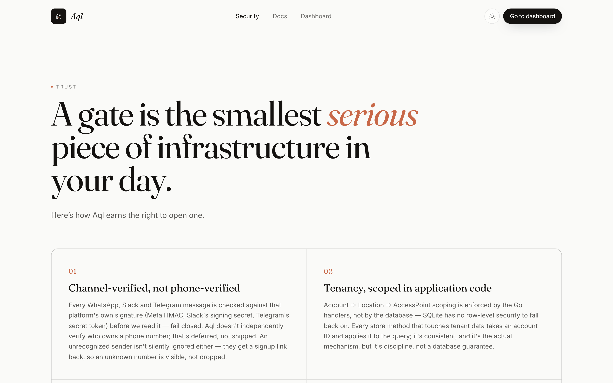
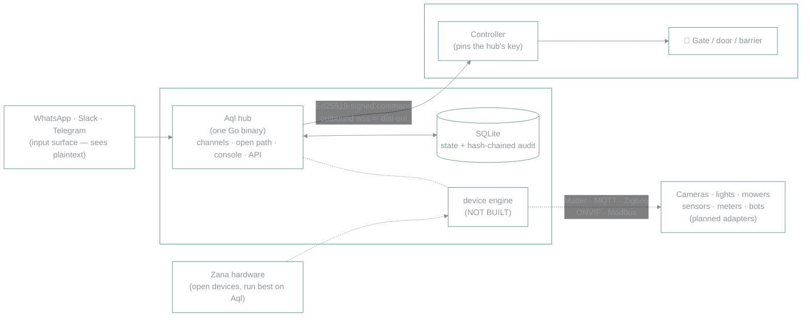

<p align="center">
  <picture>
    <source media="(prefers-color-scheme: dark)" srcset="assets/brand/logo-wordmark-dark.svg">
    
  </picture>
</p>

<p align="center"><strong>An open-source command centre for the physical world. One hub owns everything.</strong></p>

<p align="center">
  <a href="#what-is-aql">What</a> ·
  <a href="#what-actually-works-today">Status</a> ·
  <a href="#quick-start">Quick start</a> ·
  <a href="#how-it-works">How it works</a> ·
  <a href="#safety">Safety</a> ·
  <a href="site/docs/">Docs</a> ·
  <a href="ROADMAP.md">Roadmap</a>
</p>

<!-- Plain-text badges on purpose: rendering this README triggers no external
     image fetches — same no-network-by-default ethos as the software. -->
<p align="center"><sub><a href="LICENSE-MIT">MIT</a> OR <a href="LICENSE-APACHE">Apache-2.0</a> · Go · SQLite · React 19 · Vite · Tauri 2 · self-hosted · no account · no telemetry</sub></p>

<table align="center">
  <tr>
    <td align="center" width="33%"><strong>One hub, everything</strong><br><sub>The goal: cameras, lights, mowers, IoT sensors, energy, security &amp; cleaning bots — <em>plus</em> physical access control — under one control plane. Access control is the part that's finished.</sub></td>
    <td align="center" width="33%"><strong>Chat is an input surface</strong><br><sub>Text WhatsApp, Slack or Telegram and act on your hub. Opening a gate is the flagship case, not the whole product.</sub></td>
    <td align="center" width="33%"><strong>You own the box</strong><br><sub>No cloud broker, no account, no telemetry, no billing code. It works offline and it answers to you.</sub></td>
  </tr>
</table>

## What is Aql?

**Aql** (Arabic عقل — *"the mind"*) is the software brain for your physical space: one
self-hosted hub that owns the devices around a home or a business, with automations that
span all of them, and chat as one of the ways you reach it.

Its companion is **[Zana](https://github.com/vul-os/zana)** — an open-hardware line
(robot mowers, sensor nodes, security &amp; cleaning bots). Aql is designed to control
*any* hardware; Zana devices are designed to run best on Aql.

## What actually works today

This project has a documented history of correcting its own overclaims, so here is the
line, drawn hard.

### ✅ Built, tested, running

**Chat-driven physical access control, end to end.**

- **The hub** (`gateway/`) — one Go binary with SQLite inside: chat channels, the open
  path, the embedded web console, the API, the controller hub, and the audit log.
  **60 HTTP routes, 183 Go tests green.**
- **Chat channels** — WhatsApp (Meta Cloud API, HMAC-verified), Slack (Events API **and**
  Socket Mode, which needs no public URL at all), Telegram (webhook, secret-token
  verified). One person can be reachable on several channels.
- **The open path** — a single choke point every open funnels through, whichever channel
  it came from: membership, account-suspended and user-disabled checks (fail-closed),
  then open cooldown, per-member and per-account hourly caps, and optional per-location
  daily quotas. `close` is never denied. Visitor passes are refunded if an open is denied.
- **Tamper-evident audit** — `access_logs` and `admin_audit_log` are SHA-256 hash-chained
  with append-only database triggers, verifiable live or against a cold backup with
  `gateway verify-audit`, no server running.
- **The controller agent** (`controller/`) — pairing that **pins** the hub's signing key
  permanently, fail-closed command verification in a fixed order (signature → addressing
  → validity window → replay → lockdown), a durable signed event queue, and offline grant
  verification over LAN/mDNS. **45 Go tests green.**
- **Signed commands** — Ed25519 with nonce and expiry. A hostile network, a DNS hijack or
  a malicious tunnel cannot forge an open.
- **Wire contracts** (`proto/`) — **61 conformance vectors, 68 checks**, consumed by both
  the hub's and the controller's own test suites, plus an independent `verify.mjs`
  self-checker.
- **A cross-module e2e harness** that boots the real hub and controller binaries and
  drives the open path over the wire.

### 🔨 Not built

- **The device engine.** There is **no** Matter, MQTT, Zigbee, ONVIF, Modbus or Z-Wave
  driver in this repository. Not a stub, not an interface — nothing. The only device
  class Aql drives is a gate/door/barrier controller.
- **The automations runtime.** No rule object, no scheduler, no execution engine.
- **Energy metering.** No ingestion, no rollups, no source-mix accounting.
- **The phone half of offline emergency access.** The wire contract, the controller-side
  verification and the hub's issuance endpoint are all real and conformance-tested —
  but nothing on a resident's phone requests, stores or presents a grant, so **that path
  does not run end to end**.
- **The GPIO relay driver.** The default controller build uses a mock relay that only
  logs; the `-tags gpio` file is a stub that panics by design. Driving a real gate means
  writing that driver first.
- **The BLE radio.** Framing, session and verification are real and unit-tested with no
  radio; the GATT peripheral glue exists only for Linux/BlueZ behind `-tags ble` and has
  **never been validated on hardware**.
- **Geofencing, online time-window rules, analytics endpoints, Google OAuth / email
  verification / password reset, outbound webhooks, scoped API tokens, 2FA.** Some of
  these have console screens the hub does not serve; the drift is tracked mechanically by
  a route-parity test.

Phase-by-phase status: **[ROADMAP.md](ROADMAP.md)**. Adversarial view:
**[docs/THREAT-MODEL.md](docs/THREAT-MODEL.md)**.

## One honest caveat about chat

A resident texting `open` is trusting **Meta, Slack or Telegram** with that message. The
hub has to read the plaintext to act on it, so this is not and cannot be an
end-to-end-encrypted path while chat is an input surface. The platform can see who opened
which gate and when.

What it cannot do is forge an open — the command the controller accepts is signed by your
hub and verified against a key it pinned at pairing. And the web console path involves no
chat platform at all. Both halves of that are documented up front in the
[threat model](docs/THREAT-MODEL.md).

## Screenshots

The shipped web console — real captures of the real UI, with the hub's API responses
replaced by fixtures. Full annotated tour, including which screens are ahead of their
backend: **[site/docs/screenshots.md](site/docs/screenshots.md)**.

<table>
  <tr>
    <td width="50%"><br><sub><em>Dashboard — recent activity, controller health, today's opens</em></sub></td>
    <td width="50%"><br><sub><em>Access points — each with its paired controller and online state</em></sub></td>
  </tr>
  <tr>
    <td width="50%"><br><sub><em>Instance admin — totals, opens, denial breakdown, cross-account audit</em></sub></td>
    <td width="50%"><br><sub><em>The security page the hub serves to residents and trustees</em></sub></td>
  </tr>
</table>

## Quick start

**Run a hub** (this is the product):

```sh
git clone https://github.com/vul-os/aql
cd aql/gateway && go build ./cmd/gateway
./gateway -data /var/lib/aql -listen 127.0.0.1:8080
```

Pure-Go SQLite, so `CGO_ENABLED=0 GOARCH=arm64` cross-compiles cleanly for a Pi. The hub
serves **plain HTTP** and refuses to bind a public address unless you pass
`-behind-proxy` — put Caddy, nginx or a TLS-terminating tunnel in front of it.

**Run the console / desktop app:**

```sh
npm install
npm run dev          # console in a browser on :5173 — picks a hub on first run
npm run app:dev      # native desktop window (needs Rust + Tauri system deps)
npm run app:build    # platform installers
```

Then: claim the admin seat, name a location, add an access point, pair a controller, link
a channel, text `open`. The six-step walkthrough is
**[site/docs/getting-started.md](site/docs/getting-started.md)**.

## How it works

Everything runs on your box. Chat platforms deliver a message (or the hub dials out to
them); the hub decides; the hub signs; a controller at the gate verifies against a key it
pinned and pulses a relay. Controllers dial **out**, so they work behind NAT and CGNAT'd
4G SIMs with zero inbound ports.


```mermaid
%%{init: {'theme':'base','themeVariables':{'fontFamily':'ui-monospace, SFMono-Regular, Menlo, monospace','primaryColor':'transparent','primaryBorderColor':'#14b8a6','primaryTextColor':'#8f969e','lineColor':'#8a8f98','nodeBorder':'#5f8f8a','edgeLabelBackground':'transparent','clusterBorder':'#3f8f86','clusterBkg':'transparent'}}}%%
flowchart LR
    chat["WhatsApp · Slack · Telegram<br/>(input surface — sees plaintext)"]
    subgraph box["your box"]
        hub["Aql hub<br/>(one Go binary)<br/>channels · open path · console · API"]
        db[("SQLite<br/>state + hash-chained audit")]
        eng["device engine<br/>(NOT BUILT)"]
        hub <--> db
        hub -.- eng
    end
    subgraph gate["at the gate"]
        ctl["Controller<br/>(pins the hub's key)"]
        motor["🚧 Gate / door / barrier"]
        ctl --> motor
    end
    future["Cameras · lights · mowers<br/>sensors · meters · bots<br/>(planned adapters)"]
    chat --> hub
    hub -->|"Ed25519-signed command<br/>outbound wss ⇦ dial-out"| ctl
    eng -.->|"Matter · MQTT · Zigbee<br/>ONVIF · Modbus"| future
    zana["Zana hardware<br/>(open devices, run best on Aql)"]
    zana -.-> eng
```

The device-engine layer is designed and **not built** — see
[ARCHITECTURE.md §8](ARCHITECTURE.md#8-the-device-engine--designed-not-started) and
[site/docs/devices.md](site/docs/devices.md).

## Safety

**Aql actuates physical barriers and must never be the sole egress path from a building.**
Fire and building codes in most jurisdictions require code-compliant fail-safe mechanical
or electrical release hardware on egress routes, regardless of what any access-control
system does. Aql is designed to run **in parallel** with that hardware — never in series
with it, and never as a replacement for it.

The reference controller's relay driver is *specified* fail-safe (normally-open output,
the line drops on process exit or panic → gate closed), but **the GPIO driver is an
unimplemented stub that panics by design and has never actuated real hardware in this
repository's tests.** Compliance with local fire, building, safety and accessibility codes
is the operator's responsibility.

## Documentation

**The manual** — everything about *using* Aql, rendered by the self-contained viewer at
`site/docs.html`:

| Chapter | What it covers |
|---|---|
| [Overview](site/docs/overview.md) | What Aql is, what's built, what isn't |
| [Getting started](site/docs/getting-started.md) | The six steps from nothing to texting a gate open |
| [FAQ](site/docs/faq.md) | Straight answers — including how it differs from Home Assistant |
| [Run a hub](site/docs/self-host.md) | Install, config, reachability, backup, upgrade |
| [Chat channels](site/docs/channels.md) · [Linking WhatsApp](site/docs/linking-whatsapp.md) · [Ingress](site/docs/ingress.md) | Attaching channels, and what needs a public URL |
| [Instance admin](site/docs/admin.md) · [Rate limits & quotas](site/docs/limits.md) · [Troubleshooting](site/docs/troubleshooting.md) | Operating a hub |
| [Controllers](site/docs/controllers.md) · [Emergency access](site/docs/emergency-access.md) | Wiring, pairing, and the offline grant path |
| [Devices, energy & automations](site/docs/devices.md) | The unbuilt half, stated honestly |
| [Architecture](site/docs/architecture.md) · [Security](site/docs/security.md) · [API](site/docs/api.md) · [Screenshots](site/docs/screenshots.md) | Reference |

**Deep reference** — for contributors and auditors: [`docs/`](docs/) holds the
[threat model](docs/THREAT-MODEL.md), the [KOTVA alignment audit](docs/KOTVA-ALIGNMENT.md),
the [chat command reference](docs/CHAT-COMMANDS.md) and the
[design system](docs/DESIGN-SYSTEM.md). The canonical long-form architecture is
[ARCHITECTURE.md](ARCHITECTURE.md) at the root. The split between the two doc sets is
stated in [docs/README.md](docs/README.md).

## Development

```sh
npm install
npm run typecheck     # tsc --noEmit
npm test              # vitest — includes the route-parity guard against the real hub
npm run build         # tsc -b && vite build
npm run check:claims  # docs-vs-code feature-claim guard
npm run test:e2e      # Playwright against a real hub binary
npm run screenshotter # regenerate console screenshots

cd gateway    && go test ./...   # 183 tests
cd controller && go test ./...   # 45 tests
cd e2e        && go test ./...   # real binaries over the wire
node proto/vectors/verify.mjs    # 61 vectors, 68 checks
```

Read [CONTRIBUTING.md](CONTRIBUTING.md) and [ARCHITECTURE.md](ARCHITECTURE.md) before
changing anything structural. Note that the `LINTEL_*` environment variables, the
`lintel.db` filename and the controller's `_lintel._tcp` mDNS service keep their pre-merge
names on purpose — they are a deployment and wire contract for hubs and controllers
already in the field.

## Ecosystem

Aql is one half of a pair:

- **Aql** — the brain (this repo): the software command centre.
- **[Zana](https://github.com/vul-os/zana)** — the body: open-hardware designs for the
  devices Aql is meant to control (robot mower, sensor nodes, security &amp; cleaning bots).

## License

Dual-licensed **[MIT](LICENSE-MIT) OR [Apache-2.0](LICENSE-APACHE)** — © VulOS. Aql is a
VulOS project; source and issues at
[github.com/vul-os/aql](https://github.com/vul-os/aql).

---

<p align="center">
  <a href="https://vulos.org"></a><br>
  <sub><a href="https://vulos.org"><b>vulos</b></a> — open by design</sub>
</p>
