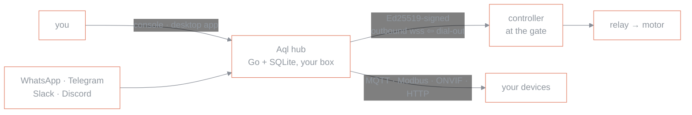
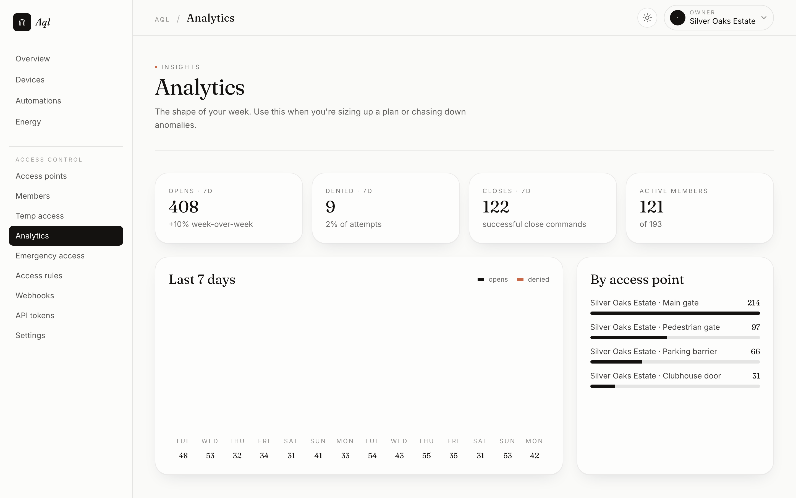
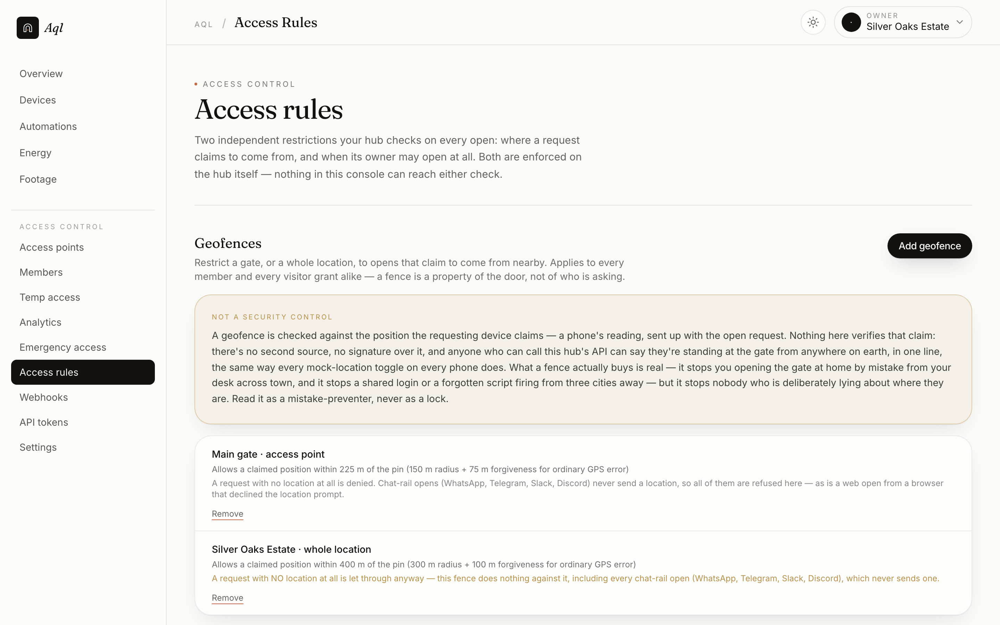
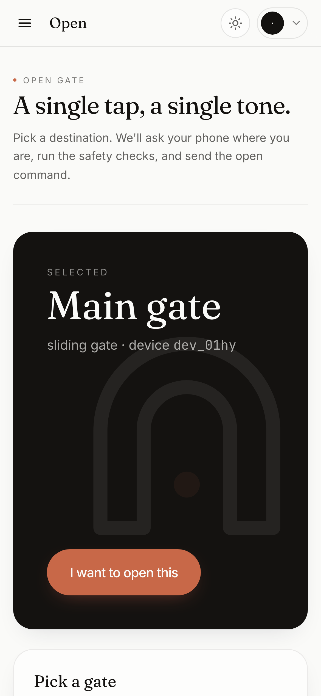
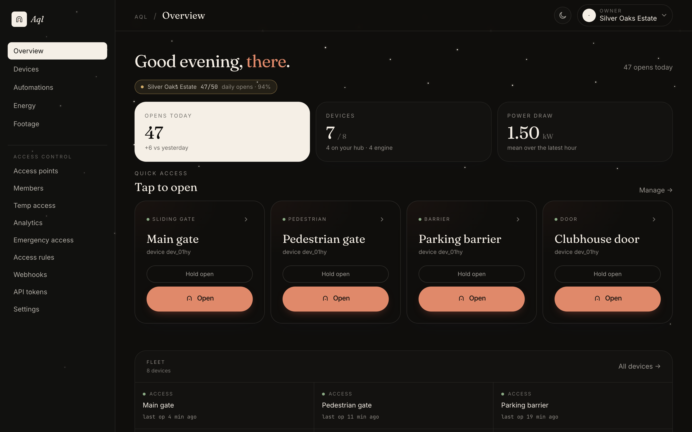
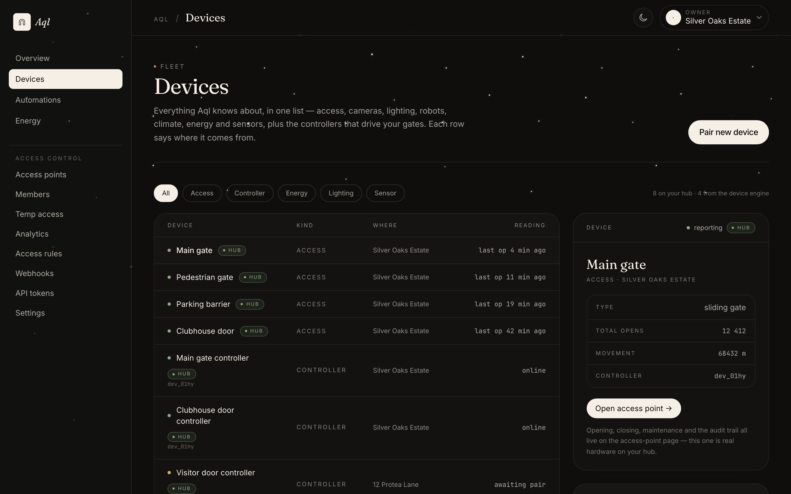

<div align="center">


# Aql

<sub>Arabic **عقل** — *the mind*</sub>

### One hub for everything physical around you.

Devices, energy, automations, cameras and access control — **self-hosted**,
**chat-driven**, running on **your own box**. No cloud account, nothing phoning
home, no subscription.

<!-- Plain-text badges on purpose: rendering this README fetches nothing from
     anywhere — the same no-network-by-default ethos as the software itself. -->
<sub>
<a href="LICENSE-MIT">MIT</a> OR <a href="LICENSE-APACHE">Apache-2.0</a> ·
Go 1.25 · SQLite · React 19 · Tauri 2 ·
<a href="site/docs/self-host.md">single binary</a> ·
<a href="site/docs/reachability.md">works behind CGNAT</a> ·
no account · no telemetry
</sub>

[**Quick start**](#quick-start) · [**Docs**](site/docs/) · [**Architecture**](ARCHITECTURE.md) · [**Self-hosting**](site/docs/self-host.md) · [**Security**](SECURITY.md)

<br/>


</div>

---

## What is Aql?

Aql is a **command centre for the physical world**: one self-hosted hub that owns
the devices around a home, a yard, a farm or a small business. It runs as a Go
binary on a Raspberry Pi or any always-on machine, keeps its data in SQLite on
your disk, and answers to a web console, a desktop app, or a message you send
from WhatsApp, Telegram, Slack or Discord.

Its device model has **seven kinds** — camera, lighting, robot, climate, energy,
sensor, and **access**. Access control is the one built furthest: signed commands,
a controller that pins your hub's key, offline emergency grants, and a
tamper-evident trail. The rest share the same engine, the same safety model and
the same console.

The hub **dials out**. It refuses to bind a public address unless you explicitly
put it behind a proxy, so a Pi on your LAN behind CGNAT runs chat, the console and
its controllers end to end — no port forwarding, no static IP.

Vendor-neutral by design, and paired with [**Zana**](https://github.com/vul-os/zana),
an open-hardware line — mowers, sensor nodes, security and cleaning bots — built
to run best on Aql.


```mermaid
%%{init: {'theme':'base','themeVariables':{'fontFamily':'ui-monospace, SFMono-Regular, Menlo, monospace','primaryColor':'transparent','primaryBorderColor':'#D0471F','primaryTextColor':'#8f969e','lineColor':'#8a8f98','nodeBorder':'#E07A5F','edgeLabelBackground':'transparent'}}}%%
flowchart LR
    you["you"] -->|console · desktop app| hub
    chat["WhatsApp · Telegram<br/>Slack · Discord"] --> hub
    hub["Aql hub<br/>Go + SQLite, your box"]
    hub -->|"Ed25519-signed<br/>outbound wss ⇦ dial-out"| ctl["controller<br/>at the gate"]
    hub -->|"MQTT · Modbus · ONVIF · HTTP"| dev["your devices"]
    ctl --> gate["relay → motor"]
```

---

## Features

| | |
|---|---|
| 🔌 **One device model, seven kinds** | Camera, lighting, robot, climate, energy, sensor and access — one engine with a closed capability catalogue, so the console renders any device with no protocol-specific code. |
| 📡 **Real protocol drivers** | **MQTT** — which also reaches **Zigbee** and **Z-Wave** through a `zigbee2mqtt` / `zwave-js-ui` bridge, with no radio in the hub — plus **Modbus TCP**, **ONVIF** cameras and **generic HTTP** for anything with a REST endpoint. Bridge *discovery* reads a `zigbee2mqtt` device list so you don't type forty of them; Z-Wave devices are reachable the same way but configured by topic, because only zigbee2mqtt's announcement format is decoded. |
| ⚙️ **Automations that can't run away** | `trigger → condition → action`, a scheduler that survives restarts, per-rule cooldowns, and a breaker that retires a rule that keeps failing — under a **compile-time ceiling** on what an unattended rule may actuate. No automation can open a gate; that's structural, not a setting. |
| ⚡ **Energy metering that won't flatter you** | Ingestion, hour/day/month rollups, source-mix accounting across grid, solar and battery. An hour nobody measured reads as **null**, never zero, and the chart draws it as a gap — an outage and a house using nothing are different facts. |
| 🚪 **Access control, end to end** | Ed25519-signed commands, a controller that pins your hub's key at pairing, per-member time windows, geofence rules, temporary grants, and **offline emergency access** that works with the network down. |
| 💬 **Open the gate from chat** | WhatsApp, Telegram, Slack and Discord, on your own accounts. Every rail declares [what it costs, what it can do, and who reads your messages](#what-the-chat-rails-actually-cost-you) — the platform included. |
| 📓 **A trail you can check** | Every open and every admin action is hash-chained. `aql-hub verify-audit` checks the chain against a cold backup, independently of the running server. |
| 🖥️ **Console, desktop and phone** | A React console served by the hub itself, and a Tauri desktop app that points at any hub you own. Emergency grants are requested and held in any build. Presenting one at a gate talks straight to the controller over your LAN — that works in the desktop app, and in a browser when the console is served over http; an https console can't reach a plain-http controller, and BLE needs the app either way. |
| 🔑 **Run it your way** | Scoped API tokens, outbound webhooks, two-factor auth, and a REST API for all of it. Nothing is hosted for you, ever. |

---

## Screenshots

Light-first — a warm paper canvas and a terracotta accent — with a full dark
theme one click away.

|  |  |
| :---: | :---: |
| **Devices** — every kind in one list | **Energy** — measured, estimated and unmeasured kept apart |
|  |  |
| **Automations** — when → do, with the tier ceiling shown | **Access points** — gates, doors and barriers |
|  |  |
| **Analytics** — opens, denials and who | **Access rules** — geofences and time windows, checked on the hub |
|  |  |

**On a phone** — the console at phone width, which is where a gate gets opened:

|  |  |
| :---: | :---: |
| **Open a gate** — one tap, after the safety checks | **Emergency access** — set up before you need it |
|  |  |

**Light & dark** — every screen ships both:

|  |  |
| :---: | :---: |
| **Overview**, dark | **Devices**, dark |
|  |  |

> Regenerate with `npm run screenshotter` — it boots the app against fixtures and
> captures every surface in light and dark. No hub or credentials needed.

---

## Quick start

### Run the hub

Prerequisites: [Go 1.25+](https://golang.org/dl/) and [Node 18+](https://nodejs.org/).

```bash
git clone https://github.com/vul-os/aql.git
cd aql

npm install
make -C hub portal build-portal        # build the console, embed it, build the binary

./hub/bin/aql-hub -data ./data -listen 127.0.0.1:8080
```

Open <http://localhost:8080>. That's the whole product: one binary, one SQLite
file, no account anywhere.

### Docker

```bash
docker build -t aql-hub hub
docker run -d --name aql -p 8080:8080 -v aql-data:/data aql-hub
```

### Add devices

Drivers are selected by flag and configured from one JSON file:

```bash
./aql-hub -device-drivers mqtt,modbus,camera -device-config ./devices.json
```

`access` is a driver too, and the only one needing no config file — it surfaces the gates
you already have in the engine's device list, read-only. It opens nothing: that stays on
the signed path.

Already running `zigbee2mqtt`? The hub can read your device list off it instead
of you transcribing it. `zwave-js-ui` devices work too, but discovery does not
read them — it decodes zigbee2mqtt's announcement format only, so a Z-Wave
device is configured by topic like any other MQTT device. See
[Devices](site/docs/devices.md).

### Pair a controller

The controller is a separate binary that lives at the gate. It dials **out**, so
it needs no inbound reachability either:

```bash
cd controller && go build -tags gpio -o aql-controller ./cmd/controller

./aql-controller --hub https://your-hub --claim-token <TOKEN> \
                 --relay /dev/gpiochip0:17
```

Without `--relay` it runs a mock that actuates nothing — and says so loudly at
startup. Given a relay it *cannot* open, it refuses to start rather than
reporting opens that never happened.

### Develop

```bash
npm run dev                      # Vite console, live reload
npm test                         # 374 frontend tests
npm run check:claims             # every doc claim, checked against the code

cd hub && go build ./... && go vet ./... && go test ./...
node proto/vectors/verify.mjs    # 103 protocol vector checks
```

---

## What the chat rails actually cost you

Aql runs chat on **your** accounts — your WhatsApp Business number, your bot
token, your Slack app. That removes any middleman operator between you and your
gate.

It does not remove the platform. **Meta reads every WhatsApp message.** Telegram
reads every Telegram message, and so on. None of these rails is end-to-end
encrypted to your hub, and no amount of self-hosting changes it.

So each rail declares four things: whether it can contact someone who hasn't
messaged first, how it receives, what it costs in each direction, and who sees
plaintext. The hub serves that at `GET /v1/rails/disclosure`, the console shows
it in **Settings** next to where you link an account — the point being to read it
*before* choosing a rail — and the table lives in code beside the rails so it
can't quietly go stale.

### A rail only answers people it recognises

Being invited to an account is not enough. Every rail resolves an inbound
message to a member through a **verified** identity, and accepting an invite
deliberately does not verify anything — accepting proves nothing about who holds
the handset.

So each member does one short ceremony from **Settings**, once per rail:

- **WhatsApp** — the console mints a six-character `LINK-` code and you send it
  to the gate bot *from the number you are linking*. The code proves you are
  looking at this account's console; the inbound message proves you hold the
  number. Two facts, one act, and no SMS or email — this hub sends neither.
- **Telegram, Slack, Discord** — the same shape, except the code is longer
  (twelve characters). It has to be: nobody knows their own Telegram numeric id,
  so the code cannot name the account allowed to spend it, and whoever sends it
  gets linked. Treat those codes as secrets; the console says so.

Until a member does this, their messages are **ignored rather than refused** —
which is exactly what "the bot doesn't answer me" looks like, so the console
flags an unverified number distinctly.

The ceremony does not change the exposure boundary above. A platform that reads
every message can read a link code, and one that can inject a message appearing
to come from an account can spend one. What it stops is one member claiming
another's account — the attack that actually happens — not the platform itself,
and it does not pretend otherwise.

| Rail | Receives via | Behind CGNAT | Cost | Who reads it |
|---|---|---|---|---|
| **WhatsApp** | webhook | ✗ needs an HTTPS endpoint | free in · metered out on the Cloud API; free both ways on the bridge | Meta, always — plus you |
| **Telegram** | webhook by default, or an outbound connection with `AQL_TELEGRAM_ENGINE=polling` | ✗ by default, ✓ with polling | free | Telegram, always — plus you |
| **Slack** | webhook, or an outbound connection when `SLACK_APP_TOKEN` is set (Socket Mode) | ✗ without an app token, ✓ with one | free | Slack, always — plus you |
| **Discord** | outbound connection | ✓ | free | Discord, always — plus you |

None of them can message a stranger first — with one exception you have to opt
into. That's a property of the platforms, and it means none can be turned into a
notification channel to someone who never opted in.

The exception is `AQL_WHATSAPP_ENGINE=bridge`, an unofficial WhatsApp Web client
rather than Meta's Cloud API. It is a regular account: no template wall, no
per-message billing, and it *can* message a number that never wrote in — which is
also what gets numbers banned. Aql itself only ever replies, and the hub says all
of this at `GET /v1/rails/disclosure`, which answers for the engine you actually
configured.

---

## Safety

Aql actuates real hardware, so most of the interesting design is about refusing.

- **Every verb carries a safety tier.** Reading is one thing, opening a gate
  another, starting a mower's blades a third. The tier is attached to the verb in
  a closed catalogue and the zero value is never actuable — a capability nobody
  classified cannot run by accident.
- **Automations are bounded at compile time.** The ceiling is a constant, checked
  when a rule is saved *and* again immediately before the driver call. Every
  access verb sits above it. No flag, request or config file can raise it.
- **The controller pins your hub's key** at pairing and never accepts another.
  Commands are Ed25519-signed over canonical JSON, so a replayed or edited one is
  refused at the gate rather than at the hub.
- **Offline emergency access** is verified by the controller against its own
  clock, in eleven steps, with no network involved.
- **Uncertainty is reported as uncertainty.** A driver that cannot confirm an
  actuation returns *indeterminate*, and the console says "couldn't confirm"
  rather than "failed" — because someone told an open failed presses it again.
- **The audit chain is verifiable off-box**, and direct database edits are
  detectable rather than preventable. The docs say exactly that.

Detail in [THREAT-MODEL.md](docs/THREAT-MODEL.md) and [SECURITY.md](SECURITY.md).

---

## What's real, and what isn't

Two things worth knowing before you build on this.

**Nothing here has run against physical hardware.** The drivers, the GPIO relay
and the BLE peripheral all build and are tested against fakes and loopback
servers, and none has touched a real meter, relay board, radio or gate. Wiring one
up is the first time anyone finds out whether it's right.

**Some of it isn't built.** Matter, Modbus RTU, native Zigbee and Z-Wave radios,
and robot control beyond a status row are open.

**The camera pipeline is built, and has never met a camera.** Both halves of that
sentence matter. It opens an RTSP stream and keeps the frames, depacketizes them
into H.264 NAL units, reads the encoder's real cropped resolution out of the
sequence parameter set — 1080p cameras encode 1088 lines and crop eight away, and a
muxer that misses this writes a valid file with a band of padding down one edge —
groups the units into pictures, muxes a fragmented MP4, writes clips under a
retention policy, gates watching behind a per-camera permission, and plays a clip
back in a browser `<video>` with a recent live view over Media Source Extensions.

What it does *not* do is decode a picture — it moves frames into a container rather
than interpreting them — and no part of it has ever run against real hardware. The
container is checked by Chromium's MP4 parser, which **accepts** it; it does not
play it, because the test payloads are not decodable pictures. The retention
arithmetic deletes real files under rules nobody has exercised on real footage.
[docs/CAMERA-RETENTION.md](docs/CAMERA-RETENTION.md) is the policy it implements —
written before any of the code, on purpose.
[ROADMAP.md](ROADMAP.md) tracks the rest line by line.

`npm run check:claims` checks 59 feature claims in these docs against the code and
fails when one drifts. It's how the two paragraphs above stay true.

---

## Documentation

| Document | What's in it |
|----------|--------------|
| [Overview](site/docs/overview.md) | What Aql is, in more depth than this page |
| [Self-hosting](site/docs/self-host.md) | Run it, configure it, back it up |
| [Devices](site/docs/devices.md) | The device model, drivers, automations, energy |
| [Controllers](site/docs/controllers.md) | Pairing, the relay, offline grants |
| [Reachability](site/docs/reachability.md) | Why it works behind CGNAT |
| [Emergency access](site/docs/emergency-access.md) | The offline path, end to end |
| [Architecture](ARCHITECTURE.md) | Component map and the decisions behind it |
| [Threat model](docs/THREAT-MODEL.md) | What's defended — and what explicitly isn't |
| [Protocol](proto/) | The signed wire format, with test vectors |
| [Roadmap](ROADMAP.md) · [Changelog](CHANGELOG.md) | What's next, and what changed |

---

## Under the hood

Everything above is what Aql does. This is how, for anyone deciding whether to
run it, extend it, or audit it. The [docs](site/docs/) go further; this is the
shape in one screen.

**One binary, one file.** The hub is a single Go binary with the web console
embedded via `go:embed`, and its entire state is one SQLite file in the data
directory — 28 migrations, 51 tables. Back it up by copying that file. The
controller agent is a separate Go module with its own pinned key.

**The device engine.** One internal device model, a driver-adapter seam, and a
registry that namespaces every device as `driver:id`. A driver implements
discover / read / execute; the engine owns everything else. Four ship:

| Driver | Reaches | Ceiling |
|---|---|---|
| MQTT | anything on a broker, including Zigbee and Z-Wave through `zigbee2mqtt` / `zwave-js-ui` | whatever the bridge exposes |
| Modbus TCP | meters, PLCs, inverters | **read-only by construction** — its config accepts only capabilities whose whole verb set is `TierRead` |
| HTTP / webhook | anything with a URL | as configured |
| ONVIF | cameras — discovery, stream resolution, RTSP probe, recording | no pan/tilt |

Capabilities are a **closed catalogue**, not free text: a driver cannot widen the
verb space by naming a capability nobody reviewed. Every verb carries a safety
tier, and `MaxActionTier` is a compile-time ceiling on what an unattended
automation may actuate — every access verb sits above it, so **no automation can
open a gate**, structurally rather than by configuration.

**The access path** is one choke point every open funnels through: membership,
account-suspended and user-disabled (fail-closed), time windows, geofences,
cooldown, per-member and per-account rate limits, per-member and per-location
daily quotas. `close` is never denied — someone who got in must be able to get
out. Commands are Ed25519-signed envelopes with a nonce and an expiry; the
controller pins the hub's key at pairing and verifies in a fixed normative order
before it moves a relay.

**Signing-key rotation** retains two keys and signs each command with whichever
key its target controller pins, moving controllers across one `repair` at a time.
Rotation cannot be atomic — a controller that drops between a precondition check
and its own repair would be stranded until someone factory-resets it physically —
so the old key is destroyed only when a transactional check finds nothing still
pinning it.

**The audit trail** is a SHA-256 hash chain over `access_logs` and
`admin_audit_log`, with append-only database triggers and an `aql-hub
verify-audit` CLI that runs against a cold backup with no server. It is a
*detection* control: it makes tampering evident, not impossible, and it cannot
see an attacker who edits the database and recomputes every hash forward.

**The camera pipeline** goes RTSP → H.264 depacketization → SPS parsing →
access-unit assembly → fMP4 → disk, with per-camera retention, a `camera:view`
permission that is deliberately *not* implied by owner or admin, and an audit row
for every view and every refusal. Clips are self-contained fragmented MP4, so the
console plays one in a `<video>` with no plugin and no transcode.

**Ports and process.** The hub binds loopback by default and refuses a
non-loopback address without `-behind-proxy` (resolution-aware, not a string
match). Controllers dial *out* to the hub, so nothing needs an inbound port —
which is why it works behind CGNAT. Background workers are all opt-in or idle
when unconfigured: clock sync, key rotation, camera capture, clip retention,
energy polling, the automations scheduler.

**What checks the claims.** `npm run check:claims` diffs 59 documented features
against the code and fails when one drifts; a route-parity test AST-extracts
every registered route and fails if the console cannot reach it; conformance
vectors in `proto/` are consumed by both implementations and by an independent
verifier that trusts neither.

---

## Contributing

Pull requests welcome — drivers especially, and most of all from **anyone who has
run this against real hardware**. See [CONTRIBUTING.md](CONTRIBUTING.md).

One house rule: claims in the docs have to be true. Add a feature, add its entry
to `scripts/feature-claims.manifest.mjs` — and if you find a sentence here that no
longer matches the code, that's a bug worth a PR on its own.

---

## Brand

The mark in [`brand/`](brand/) is the source of truth. Every icon this repo
ships — favicon, PWA and app icons, the mark in the README and on the site — is
rendered from `brand/logo.svg` rather than redrawn, so there is one approved
drawing and no second copy to drift.

Copy it outward, never edit a derived copy, and never edit `brand/` to match
something downstream.

## License

[MIT](LICENSE-MIT) OR [Apache-2.0](LICENSE-APACHE) — © VulOS.

---

<p align="center">
  <a href="https://vulos.org"></a><br>
  <sub><a href="https://vulos.org"><b>vulos</b></a> — open by design</sub>
</p>
