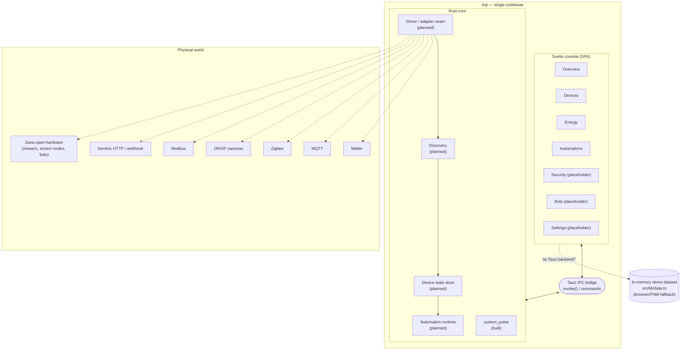

# Architecture

> [!NOTE]
> Aql is early-stage. This document describes the **intended** architecture —
> the shape the project is being built toward — and marks clearly what exists
> today versus what is planned. Treat anything not marked "Built" as design
> intent, not a shipped feature.

## What Aql is

Aql is a self-hosted **command center for the physical world**: one hub,
running on a box you own, that discovers and controls the devices around a
home or business — cameras, lights, lawnmowers, IoT sensors, energy meters,
locks, and autonomous bots (security, cleaning) — and lets you automate across
all of it from a single console.

The closest reference point is Home Assistant, but the intended scope is
broader on two axes:

- **Business, not just home.** Zones, fleets, and automations are modeled so a
  small business (multiple sites, shared circuits, patrol routes) fits the
  same data model as a house.
- **Autonomous bots as first-class devices.** Security and cleaning robots
  aren't an afterthought integration — they're a device class alongside
  cameras and sensors, with their own state machine (patrol, dock, charge).

## Layered model

Aql is one binary with two halves that talk over the Tauri IPC bridge:

| Layer | Role | Status |
|---|---|---|
| **Rust core** (`src-tauri/`) | Device/telemetry engine: discovery, driver adapters, state, automation runtime | Foundation only — one IPC command (`system_pulse`) exists; no drivers, no persistence, no automation engine yet |
| **Svelte console** (`src/`) | Operations-console UI: fleet view, energy, automations, event log | Built for Overview / Devices / Energy / Automations, on an in-memory demo dataset |
| **IPC bridge** | Tauri's `invoke`/command layer connecting the two | Built — `system_pulse` returns host OS/arch/core telemetry, proving the bridge end-to-end |

The console never talks to hardware directly. Every device read or command is
meant to flow through the Rust core, so the same UI works unmodified whether
the core is backed by real drivers or (today) nothing at all. In the browser
build, the console falls back to the in-memory demo dataset (`src/lib/data.ts`)
when there's no Tauri backend to call — see [Getting Started](./GETTING-STARTED.md).

## The driver/adapter seam

"Works with any hardware" is a control-plane stance, not a promise that Aql
ships every protocol on day one. The design is a single internal device
abstraction — an ID, a kind, a zone, a state, and a set of commands/telemetry
— that every driver maps onto. Concretely:

- **Discovery** finds devices on the network or bus (mDNS/SSDP, Zigbee pairing,
  MQTT topic scanning, ONVIF probe, manual add).
- **Drivers/adapters** translate a protocol's wire format into the internal
  device shape and back. Each protocol is its own adapter behind a common
  trait/interface in the Rust core — adding a protocol should not require
  touching the console or the other adapters.
- **The console only ever sees the internal shape.** It renders devices,
  zones, and events generically; it has no protocol-specific code.

Planned protocol adapters, roughly in the order they unlock the most devices:

| Protocol | Covers | Status |
|---|---|---|
| Matter | Modern smart-home devices (lights, locks, sensors) | Planned |
| MQTT | Broad IoT/DIY device ecosystem, Zana devices | Planned |
| Zigbee | Battery sensors, switches, bulbs | Planned |
| ONVIF | IP cameras (most brands) | Planned |
| Modbus | Energy meters, industrial/building sensors | Planned |
| Generic HTTP/webhook | Anything with an API — the catch-all escape hatch | Planned |

None of these adapters exist in code yet. The Rust core currently exposes a
single command, `system_pulse`, which returns host OS/arch/core-count
telemetry — its purpose today is to prove the IPC bridge works, not to model
devices.

## Where Zana fits

**[Zana](https://github.com/vul-os/zana)** is the companion open-hardware
line — reference designs for mowers, sensor nodes, and security/cleaning bots
built to work well with Aql. The relationship is one-directional by design:
Aql controls *any* hardware that speaks a supported protocol; Zana devices are
simply built to speak one of those protocols (most likely MQTT) out of the
box, so they need no bespoke adapter. Zana is not required to use Aql, and Aql
is not limited to Zana hardware.

## Desktop / mobile / PWA, one codebase

Aql is built once and ships four ways from the same SvelteKit source:

- **Desktop** (macOS/Windows/Linux) — `pnpm tauri dev` / `pnpm tauri build`,
  native window, Rust core runs in-process.
- **Mobile** (iOS/Android) — same Tauri v2 project, mobile targets; the Rust
  core and console are unchanged, only the shell and IPC transport differ.
- **PWA / browser** — `pnpm dev` / `pnpm build` produce a static SPA
  (`adapter-static`, `fallback: index.html`) installable as a PWA. There is no
  Rust core in this mode, so the console falls back to the in-memory demo
  dataset for anything it would normally get over IPC.
- **Self-hosted box** — the intended primary deployment: Aql desktop running
  headless-ish on hardware in the home/business, console reached locally or
  over the local network.

This is why the console never imports Rust-specific APIs directly — it always
goes through `invoke(...)`, wrapped in a try/catch that falls back to demo
data when no Tauri backend answers (see `src/routes/+page.svelte`).

## Non-negotiables

- **Local-first.** The hub is the source of truth. It runs on hardware you
  control, not a vendor's cloud.
- **You own your data.** Device state, event history, and automation config
  live on your box, in formats you can read and back up yourself.
- **No cloud dependency.** Aql must not require an internet connection or a
  vendor account to function. Cloud services (remote access, backups) are
  optional add-ons, never a requirement.
- **Works offline.** Core control loops — reading a sensor, flipping a light,
  running an automation — must keep working with no WAN link.

## What exists today vs. what's planned

| Area | Exists now | Planned |
|---|---|---|
| Console UI | Overview, Devices, Energy, Automations screens, dark ops-console styling | Security, Bots, Settings screens (currently placeholders) |
| Data | In-memory demo dataset (`src/lib/data.ts`) | Real device state backed by the Rust core, persisted |
| IPC | `system_pulse` (host telemetry) | Device discovery, read/command, event stream, automation CRUD |
| Device integration | None | Matter, MQTT, Zigbee, ONVIF, Modbus, HTTP/webhook adapters |
| Automation | Static demo rows in the UI | Real rule engine (trigger → condition → action) driven by device state |
| Auth | None | Local account/session model for the console; no cloud auth |
| Persistence | None (in-memory only) | Local embedded store on the box |
