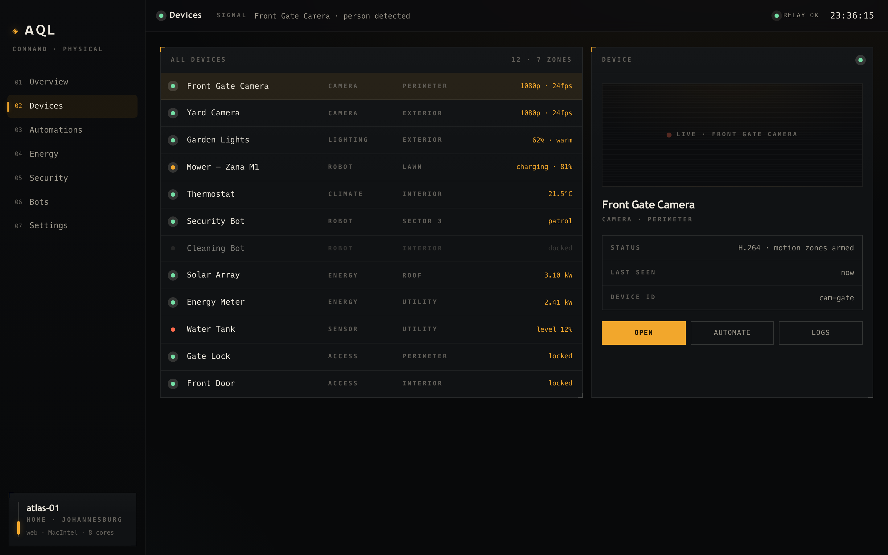
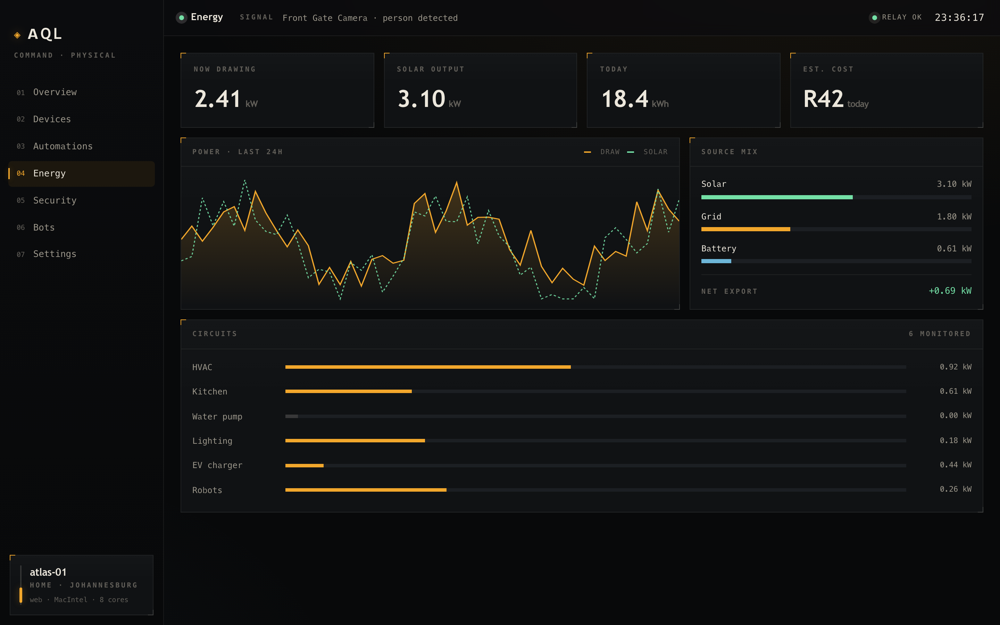
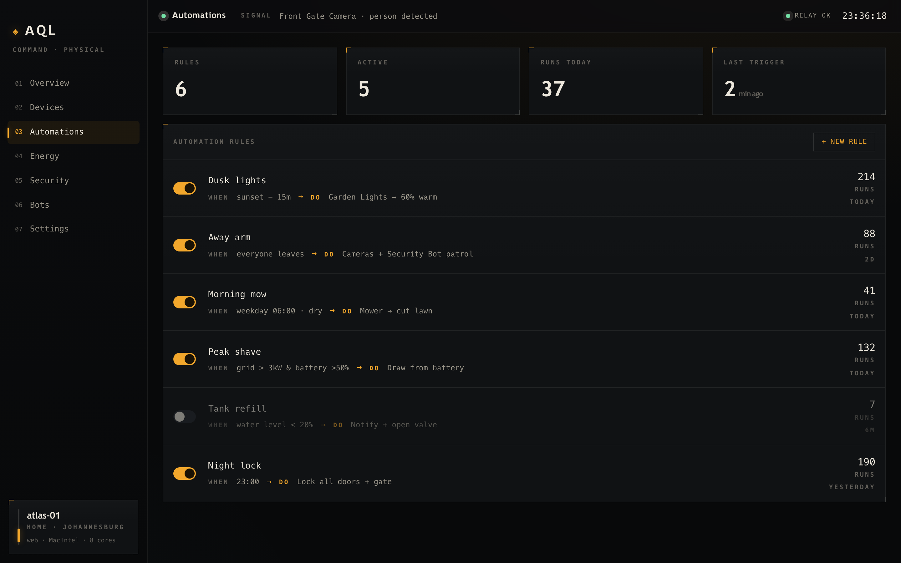

# Screenshots

> [!NOTE]
> These are real captures of the shipped desktop app UI, running on the
> in-memory demo dataset (`src/lib/data.ts`) — there is no device engine behind
> them yet. Dark operations-console theme. Regenerate anytime with
> `npm run screenshot` (Playwright drives a `vite dev` build, no backend
> required).

## Overview

Live readouts for devices online, power draw, active automations, and alerts,
plus the device Fleet grid with breathing status dots, a live "signal"
waveform, and a scrolling event log.

## Devices

The full device list alongside a detail panel — camera live-feed preview,
current status, and controls for the selected device.

## Energy

A 24-hour power chart (draw vs. solar), the current source mix
(solar/grid/battery), and per-circuit consumption bars.

## Automations

Automation rules expressed as when → do flows, each with an enable toggle and
a run count.
