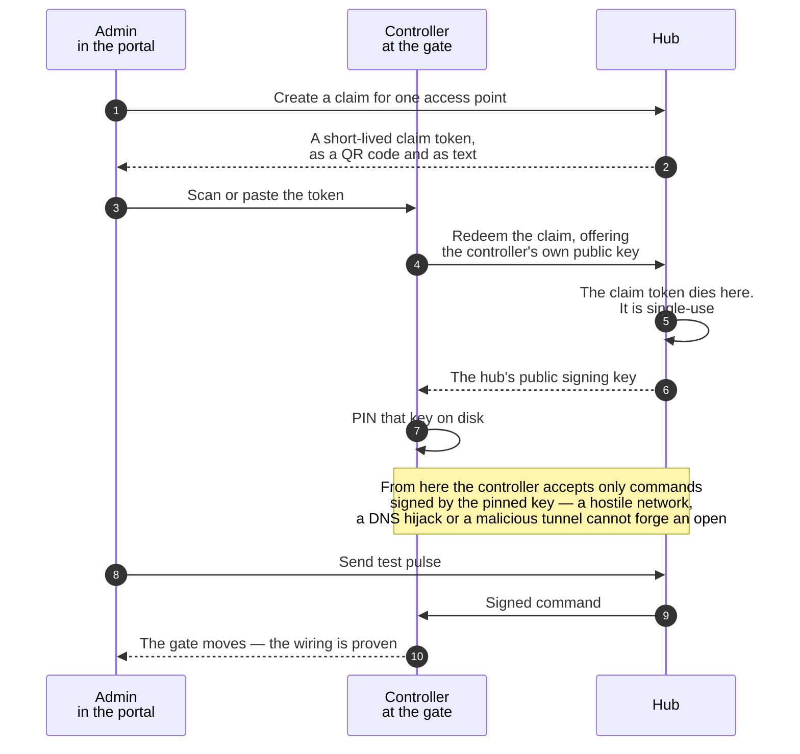

# Controllers

A controller is the unit at the gate: a Pi-class board running the Aql agent,
wired to the motor's relay input, on Wi-Fi or a GSM 4G SIM. It dials **out** to exactly
one hub, verifies every command's signature against that hub's pinned key, and
pulses the relay.

Because the connection is outbound (persistent WebSocket), a controller works behind
NAT, behind CGNAT on a prepaid SIM, and behind whatever router your complex's IT
volunteer configured in 2014. Zero inbound ports, zero port-forwarding.

## The reference agent (real today)

The agent in [`controller/`](https://github.com/vul-os/aql/tree/main/controller) is
a real, standalone Go module — std-lib first, no CGO. What's **implemented and
conformance-tested** against the `proto/` vectors: fail-closed command verification
(signature, addressing, replay window, lockdown), pairing with hub-key **pinning**,
a durable signed event queue, the WSS transport, and **offline grants over both LAN/mDNS
and BLE** (the BLE framing codec + session verified at ATT MTUs 23/185/512). A
cross-module e2e harness boots the real hub and controller binaries together and
proves the money path end to end.

**Kept honest — what is still stubbed:**

- **GPIO relay driver** — not implemented. The default build uses a **mock relay that
  only logs** actuations, and the `-tags gpio` file is a stub that **panics on purpose**
  (`relay: gpio build-tag stub — implement the gpiochip driver before deploying to
  hardware`, `controller/internal/relay/gpio.go`). Driving a real gate means writing that
  driver yourself, to the fail-safe specification: normally-open output, line drops on
  process exit or panic → gate closed. **No build of this agent has ever actuated real
  hardware in this repository's tests.**
- **BLE radio** — the framing codec, the session layer and grant verification are real
  and unit-tested with no radio present. The GATT peripheral glue builds for **Linux
  (BlueZ) and Windows (WinRT) behind `-tags ble`** and has **never been validated on
  hardware** on either; darwin gets a stub returning `ErrUnsupported`, because the
  Bluetooth library binds no peripheral API there.
- **Position/tamper sensors** — real debounced GPIO inputs under `-tags gpio`, selected
  with `-relay …,sensor=<line>`; the mock relay still returns static values.

Build and drive it without any hardware:

```sh
cd aql/controller
go build ./...                                   # default build, zero external deps

# Live agent against a dev hub (mock relay; prints state transitions)
go run ./cmd/controller-sim --gateway http://localhost:8080 --claim-token <TOKEN>

go run ./cmd/controller-sim --offline-demo       # replays offline-grant vectors + a live LAN open
go run ./cmd/controller-sim --ble-demo           # BLE grant flow through the framing codec (no radio)
```

On a real device the agent pairs once with a claim token and persists the result:

```sh
go run ./cmd/controller \
  --state /var/lib/aql --gateway https://gate.example.com \
  --claim-token <TOKEN> --access-points <ACCESS_POINT_ID>
```

`--lan :8737` serves offline grants on the LAN (on by default); `--ble` enables the BLE
peripheral (requires a `-tags ble` Linux build).

## Wiring (in 30 seconds)

The controller's relay sits **in parallel** with your existing remote receiver's relay.
Find the two terminals on the gate motor that the receiver pulses — usually labelled
`COM` and `NO` — and tap into them. That's the entire wiring job:

```
gate motor        COM ──┬── existing receiver relay
                        └── Aql controller relay
                  NO  ──┴───────────────┘
```

- Most installs share the motor's 12&nbsp;V supply instead of the included adapter.
- For 24&nbsp;V or AC motors, use an optoisolated relay board between controller and motor.
- Your existing remotes, keypads and intercom keep working. Aql is in parallel,
  never in the way.

## Pairing: the claim-token flow

Pairing binds a controller to one access point on one hub, and — critically — pins
that hub's public signing key in the controller's storage. The flow:



1. **Admin creates a claim.** Portal → Devices → *Pair new*. Pick the access point
   (e.g. *Oakridge · Main gate*). The portal shows a short-lived claim token, as a QR
   code and as text.
2. **The device redeems it.** Give the controller the token (scan the QR with the app
   while on the controller's setup Wi-Fi, or paste it into the agent's console). The
   controller calls the hub, redeems the claim, and the two exchange keys: the
   controller's public key is stored server-side; the hub's public signing key is
   **pinned** on the device.
3. **Keys are fixed from here.** The claim token dies on redemption. From now on the
   controller accepts only commands signed by the pinned key — a hostile network, DNS
   hijack or malicious tunnel cannot forge an open.
4. **Test pulse.** The portal's *Send test pulse* button proves the wiring. If the gate
   moves, you're done.

LED language on the reference controller: pulsing orange — connecting; solid —
online and paired; brief green flash — command executed; red — see
[Troubleshooting](troubleshooting.md).

## Wi-Fi or GSM?

- **Wi-Fi** — free and fine when the gate is in range of a reliable network. Remember
  the gate is often the far corner of the property; test signal at the motor, not at
  the house.
- **GSM (4G SIM)** — the controller carries its own connectivity; nothing on-site can
  take it down but a dead battery. Data use is tiny (a quiet WebSocket plus commands).
  CGNAT is fine — the controller only dials out.

## Replacing and rotating

Every controller has its own keypair, generated on first boot; the private key never
leaves the device. If a controller is lost, stolen or replaced, revoke it in the portal
(its key is dead server-side within the same second) and pair its replacement with a
fresh claim. No other device on the account is touched.

## Events upstream

The signed-command contract is two-way: controllers report events upstream — command
results, button presses, gate-held-open, tamper. Result acks power the "Gate opened ·
1.8 s" replies in chat; the richer events (visitor button → "someone at the gate, reply
OPEN", held-open alerts, lockdown) are **protocol-ready now and ship as features later**.
