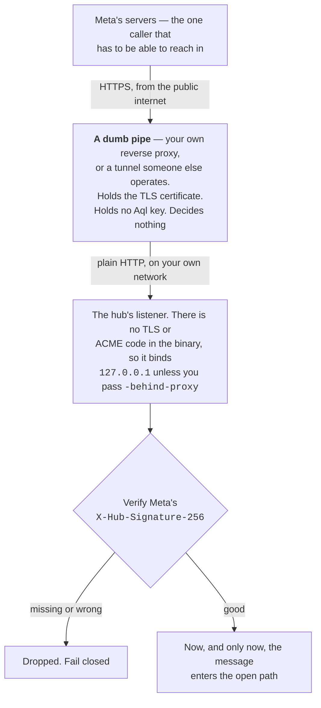

# Public URL & TLS

This chapter is the how-to for the one case where a hub needs a public HTTPS endpoint:
you want **WhatsApp**, or you want **console access from outside your LAN**.

If you are not sure whether you need one at all, start with
[Reachability](reachability.md) — it answers "I run this at home with no static IP, what
do I actually need?" and for most installs the answer is *nothing*. This page assumes you
have already decided you want a URL, and covers how to get one and what TLS obligations
come with it.

> **TLS is entirely the operator's responsibility.** The hub has no TLS or ACME code of
> its own — grep the source and there is no `autocert`, no `ListenAndServeTLS`, nothing.
> Every option below assumes something *else* — a reverse proxy you run, or a tunnel that
> terminates TLS at its own edge — sits in front of the hub's plain-HTTP listener. The
> binary refuses to bind a non-loopback address without `-behind-proxy` for exactly this
> reason (`hub/cmd/hub/main.go:159`): binding a public interface with nothing in
> front would serve the admin portal, the login endpoint and the signing API in
> cleartext — credentials, JWTs and refresh tokens included.

## Why WhatsApp is the one that forces this

The **WhatsApp Cloud API only speaks webhooks** — Meta's servers make an outbound HTTPS
`POST` to *your* hub every time someone messages your number. There is no long-poll or
socket alternative Meta offers; if you want WhatsApp, Meta must be able to reach a public
HTTPS URL you control. That single fact is the entire reason a self-hosted Aql install
might need a public endpoint at all.

Nothing else in Aql requires it. Controllers dial **out** to the hub, Slack Socket Mode
dials out to Slack, and offline grants need no network whatsoever. The full rail-by-rail
breakdown is in [Reachability](reachability.md).

Whatever you put in front is a **dumb pipe** — it holds no keys and makes no
authorisation decision. The hub verifies Meta's `X-Hub-Signature-256` itself before
acting on anything (`hub/internal/channels/channels.go:194`), so a compromised or
third-party-operated ingress can drop or delay messages but cannot forge an open. That
reasoning, in full, is in [Reachability](reachability.md#whatever-you-put-there-is-a-dumb-pipe-not-a-gateway).



## (a) Public bind + your own reverse proxy — no tunnel, no third party

The simplest option if you already have a VPS, a static IP, or a router you can
port-forward on: point a DNS name at the box and run a reverse proxy (Caddy, nginx,
Traefik) in front of the hub. The proxy holds the certificate, speaks HTTPS to the
world, and forwards plain HTTP to the hub — which you bind to `127.0.0.1` (or
another private interface), never to a public one directly, since the binary has no
TLS of its own to protect it if you do.

Caddy is the least ceremony — automatic Let's Encrypt certificates and renewal from a
four-line config:

```
# /etc/caddy/Caddyfile
your-gate.example {
    reverse_proxy 127.0.0.1:8080
}
```

```sh
./aql-hub -listen 127.0.0.1:8080 -public-url https://your-gate.example &
caddy run   # or: systemctl enable --now caddy
```

nginx or Traefik do the same job if you already run one of those. Nothing else in the
loop besides the proxy — you own the whole path from Meta to your hub.

- Costs: your VPS/hosting bill only.
- Trade-off: you're responsible for the box being reachable and the proxy staying
  patched — firewall rules, port forwarding on CGNAT-free connections, certificate
  renewal (automatic with Caddy, cron/certbot with nginx).

## (b) Any tunnel you already trust

If your box has no public IP (home connection, CGNAT, a Pi behind a residential
router), a tunnel forwards a public HTTPS endpoint to your local hub port. Nothing
about Aql is coupled to a specific tunnel — pick whichever you're already
comfortable operating:

- **cloudflared** (standard mode), **Tailscale Funnel**, **ngrok**, or your own — run
  it beside the hub binary, point it at the local port
  (e.g. `http://localhost:8080`), done. These terminate TLS at their own edge or local
  agent and forward plain HTTP the rest of the way over loopback — that matches the
  hub exactly as it is, no separate reverse proxy needed.
- **`vulos-relayd`** — the open-source reverse-tunnel daemon (WSS + yamux, SSRF-guarded).
  It's MIT-licensed and **self-hostable with no account needed** — you run the client
  agent yourself, beside the hub, the same way you'd run any other tunnel here. It
  terminates the WSS tunnel locally and forwards plain HTTP to the hub over loopback —
  the same pattern as the others. It's listed alongside them because it happens to exist
  and is a solid option, not because Aql depends on it.

One thing this doesn't cover: a tunnel run in **raw TCP / SNI-passthrough** mode (e.g.
`frp` configured for TCP passthrough rather than its HTTP proxy mode) forwards the
still-encrypted bytes all the way to the hub instead of terminating them — and the
hub has no TLS code to receive that with, so it just fails. If you specifically
want that shape (the tunnel provider never even has TLS-terminating access), run your
own reverse proxy — see option (a) — behind the passthrough to do the termination
locally; don't point a raw passthrough tunnel straight at the hub's listener.

- Costs: whatever the tunnel provider charges (often free for personal use), plus your
  own compute.
- Trade-off: one more moving part to operate; outages in the tunnel take your WhatsApp
  channel down even if the hub is healthy.

## (c) A tunnel someone else operates

If you'd rather not run and monitor a tunnel yourself, someone can operate one for you.
The **Vulos relay** and **[Pier](https://github.com/vul-os/pier)'s reachability
adapter** are the in-family versions of the same `vulos-relayd` model — the broker your
box dials out to. Point the hub at one the same way you'd point it at any other tunnel.

Both are open source and self-hostable, so you can just as well run your own instead.
Note that Pier is **`pre-alpha` by its own README badge**; treat it as an experimental
option, not a recommended default, and prefer (a) or (b) for anything you depend on.

- Costs: nothing if you self-host; whatever the operator charges if you use a hosted
  instance.
- Trade-off: none technically — it's the same tunnel model as (b), just operated for
  you, plus the maturity caveat above. It's an *option*, never a requirement: Aql has no
  code path that assumes any of it exists, and every self-host guide in this repo works
  without it.

## The suite rule this follows

Aql has no hard runtime dependency on any Vulos product, ever — it is a standalone,
MIT-licensed system that runs to completion with nothing but a box and, optionally,
your own channel credentials. `vulos-relayd`, the Vulos relay and Pier show up here
strictly as *feature-scoped* options for a single rail (WhatsApp), competing on equal
footing with cloudflared, nginx and a port-forward. Nothing breaks, degrades, or nags you
if you never touch them.

Full self-host walkthrough: [Run a hub](self-host.md). Per-rail setup:
[Chat channels](channels.md). Do-I-even-need-this: [Reachability](reachability.md).
