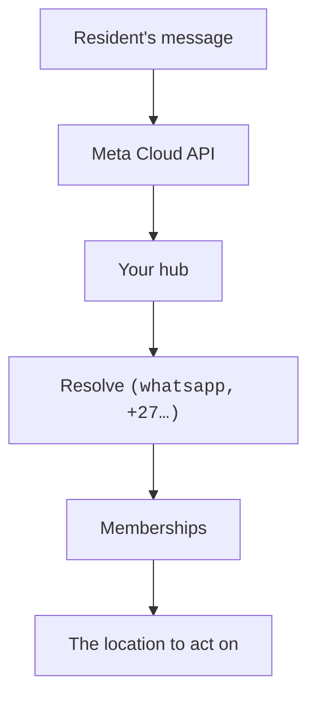

# Linking WhatsApp

WhatsApp is Aql's primary channel — and the one with genuinely hard setup, because
Meta gates it behind business verification. This chapter is what it takes to bring your
own number to your hub. (If you want to be texting your gate *today*, start with
Slack — minutes, not days — and add WhatsApp when the WABA clears.)

> **WhatsApp is the one rail that genuinely needs a public HTTPS endpoint**, because
> Meta's Cloud API is webhook-only — there is no polling mode to fall back to. The hub
> does not care what provides that endpoint: a tunnel, your own reverse proxy or a relay
> someone else runs all reduce to a URL in `AQL_PUBLIC_URL`, and whatever provides it
> also terminates TLS. See [Reachability](reachability.md), and
> [Public URL & TLS](ingress.md) for the how-to.

Once linked, the flow is simple: residents text your number, Meta's Cloud API delivers
the webhook, and the hub routes each message by its sender:



Invite a member by phone number, then have them **verify** it: the console mints a
short `LINK-XXXXXX` code under **Settings → Phone numbers**, and the member sends that
code to the gate bot from the number itself. Two facts in one act — the code proves
they are looking at this account's console, and the inbound message proves they hold
the number.

Accepting an invite links a number but never verifies it, because accepting proves
nothing about who holds the handset. An unverified number is ignored by the chat rails,
so a member who skips this step will text the gate and get no reply. The console shows
unverified numbers distinctly for exactly that reason.

The number residents should save is shown in the portal under **Settings → Channels →
WhatsApp**.

## Bring your own WABA

A hub that wants a WhatsApp channel needs its own **Meta Cloud API** setup. This is
the high-friction channel — budget an afternoon and some patience:

1. **A Meta Business portfolio**, verified. Meta's business verification can take days
   and wants real documents.
2. **A WhatsApp Business Account (WABA)** inside it, created in the Meta developer
   console along with an app.
3. **A phone number** registered to the WABA. It must be able to receive a one-time
   verification call or SMS, and it stops working as a personal WhatsApp number.
4. **Webhook configuration** — point Meta at your hub's public URL
   (`https://your-gate.example/webhooks/whatsapp`), set the verify token, and subscribe to
   the `messages` field.
5. **Credentials into the hub** — the permanent access token, app secret and phone
   number id go in your hub's `.env`. The hub verifies every incoming webhook
   with Meta's HMAC signature; unsigned or mis-signed payloads are dropped.

One honest note for those who push through: Meta charges per-conversation fees on your
WABA and bills you directly — those costs are between you and Meta, never routed
through Aql. Slack takes minutes — see [Chat channels](channels.md) — and many
hubs run Slack-first, WhatsApp later or never.

## The non-conformant escape hatch: a self-hosted bridge

> **Do not read this section as an equal option. It is not.** The official Meta Cloud
> API above is the only conformant way to run a WhatsApp channel on Aql. The bridge
> engine documented here exists in the code
> ([`hub/internal/channels/send.go:168`](https://github.com/vul-os/aql/blob/main/hub/internal/channels/send.go#L168)),
> it is opt-in, it is off by default — and using it **violates KOTVA §26.8.2's
> unconditional MUST NOT on unofficial WhatsApp client libraries** and puts your own
> WhatsApp number at real risk of being banned. It is documented here because hiding a
> code path would be its own dishonesty, not because it is recommended.

If the WABA process above is a dealbreaker, the hub can instead talk to a
self-hosted, **unofficial** WhatsApp Web bridge (target: Evolution API, which fronts
Baileys) rather than Meta's Cloud API:

```sh
AQL_WHATSAPP_ENGINE=bridge
AQL_WHATSAPP_BRIDGE_URL=https://bridge.example.internal:8080
AQL_WHATSAPP_BRIDGE_API_KEY=…
AQL_WHATSAPP_BRIDGE_INSTANCE=…
```

What you are accepting when you set that variable:

- **A specification violation.** KOTVA §26.8.2 carries an unconditional *MUST NOT* on
  integrating unofficial, reverse-engineered WhatsApp client libraries — Baileys and
  everything fronting it. Selecting `bridge` puts your hub out of conformance, on
  purpose. See [`docs/KOTVA-ALIGNMENT.md`](https://github.com/vul-os/aql/blob/main/docs/KOTVA-ALIGNMENT.md).
- **A real ban risk to your own account.** Meta actively detects and bans automated and
  unofficial clients, and tightened its terms further on 2026-01-15 — reported number
  survival on unofficial APIs is commonly **weeks, not years**.
- **A loud startup warning, every time.** Selecting `bridge` logs the ban-risk warning
  on every boot ([`send.go:238`](https://github.com/vul-os/aql/blob/main/hub/internal/channels/send.go#L238)).
  That warning is deliberately not softened and must not be removed.

The engine is opt-in only and fails closed toward the official path: leave
`AQL_WHATSAPP_ENGINE` unset, misspell it, or use anything but the exact string
`bridge`, and the hub uses Meta's `cloud` engine
([`ResolveWhatsAppEngine`, send.go:223](https://github.com/vul-os/aql/blob/main/hub/internal/channels/send.go#L223)).

**A banned number goes silent on WhatsApp, with no notice to residents.** The
[emergency-grant path](emergency-access.md) is not what saves you here, and the reason
is worth being precise about: it works now — the hub mints grants, the console holds
one, and it can be presented over your LAN — but it exists for a hub you cannot
REACH, and it has to be set up before that happens. A banned WhatsApp number leaves
the hub perfectly reachable; only that one rail goes quiet. So the answer is the
things that still work, and they have to be in place beforehand too:

- **The web portal** — unlimited opens through the hub's own dashboard, no chat
  channel involved at all.
- **A second working chat channel** — Slack Socket Mode or Telegram (see
  [Chat channels](channels.md)) — so a WhatsApp ban doesn't mean *no way to text the
  gate*, just one fewer way.

Set one of those up and confirm it works **before** you turn `bridge` on. If neither is
acceptable, stick with the official Cloud API above, slow business-verification process
and all — that is the recommendation, without qualification.

## Which number should residents see?

We recommend a **dedicated number** for the property rather
than someone's personal number: residents shouldn't see a personal profile photo and
status, and the number should survive a change of trustees.

## If the link fails

- **Webhook verification never completes** — Meta must be able to reach your hub's
  public URL over HTTPS. If you're behind NAT, set up a tunnel first
  ([Run a hub → Reachability](self-host.md)).
- **Messages arrive but are rejected** — check the app secret. The hub fail-closes
  on a webhook signature mismatch and answers **403** with the reason in the body:
  `bad_signature` (the secret does not match), `missing_signature` (no
  `X-Hub-Signature-256` header at all) or `webhook_secret_unset` (the hub has no
  app secret configured, so it cannot verify anything and refuses rather than
  trusting the request). Meta shows that response in the app's webhook delivery
  view, which is where to look — nothing is written to the audit log, because the
  request never authenticated as anyone and a public endpoint that appends a row
  per rejected POST is one an attacker can fill at will.
- **The number won't register** — numbers already bound to a personal WhatsApp account
  must be released first, and some virtual/VoIP numbers can't receive Meta's
  verification call. A cheap prepaid SIM is the boring, reliable answer.
