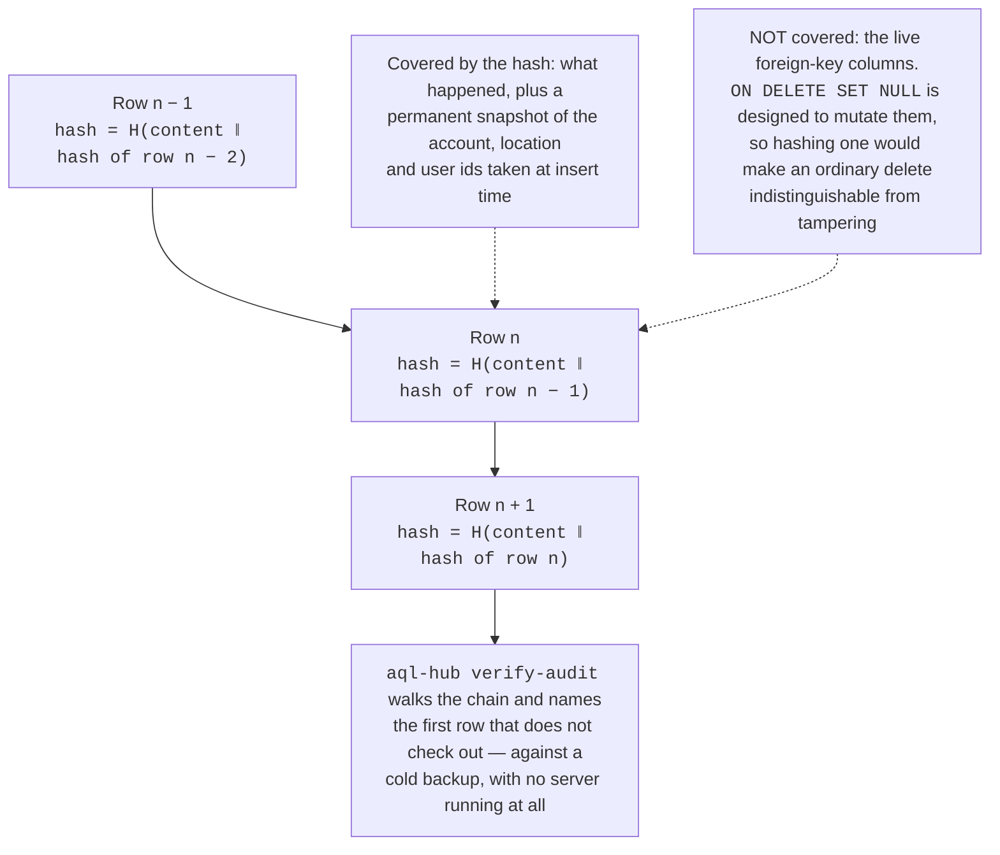

# Security

A gate is the smallest serious piece of infrastructure in your day, and access control
is the first device kind Aql's hub drives end to end — the wider device engine
(cameras, lighting, robots, climate, energy) isn't built yet. This chapter is how
Aql earns the right to open a gate today — and it applies to every hub alike, because
there is only one binary.

## The layers

| Layer | Mechanism |
| --- | --- |
| Command integrity | Ed25519-signed commands with nonce + expiry; the controller pins the hub's key at pairing |
| Pairing | Claim-token flow: admin creates a claim, the device redeems it once, keys are exchanged |
| Emergency grants | Short-TTL signed capability bound to the app's keypair; nonce challenge-response — **controller-side verification and hub-side issuance are both real and conformance-tested; the app doesn't request/present a grant yet, see below** |
| Channel ingress | Per-channel verification (Meta HMAC, Slack signed-request scheme + replay window, Telegram secret-token header) — fail closed, and done **by the hub itself**, so whatever forwards the request to it cannot forge one |
| Tenancy | Tenant-isolated at the query layer — app-layer org scoping on every SQLite query in the Go hub, including the rate-limit and quota counters |
| Transport | Plain HTTP — the binary has no TLS/ACME code at all. TLS is the operator's job: a reverse proxy or a TLS-terminating tunnel in front of the hub. `-listen` refuses to bind a non-loopback address on its own — see [Reachability](reachability.md) |
| Audit | Hash-chained, tamper-*evident* event log: every open, denial, pairing and config change, with append-only DB triggers and a verify command that works against a cold backup — see **Tamper-evident audit log** below for exactly what that does and doesn't guarantee |
| Login | Per-IP and per-account brute-force throttles on login/register/refresh/admin-claim, fail-closed; live per-request session revocation; a "log out everywhere" endpoint — see **Login & session security** below |
| Abuse limits | Cooldowns, hourly caps and optional per-location quotas at one choke point — see [Rate limits & quotas](limits.md) |

## Signed commands and key pinning

Every command a controller receives is signed by its hub's Ed25519 key, carries a
random nonce, and expires seconds after issue. The controller learned that key exactly
once — at pairing — and pins it. The consequences are pleasant:

- A hostile network, a DNS hijack, or a malicious tunnel provider **cannot forge an
  open**. They can at worst delay traffic.
- A captured packet is a paperweight: the nonce window rejects replays, the expiry
  rejects late delivery.
- Each controller has its own keypair, generated on first boot; the private key never
  leaves the device. Losing one device never compromises another.

Because the controller dials out and verifies content, not network position, Aql
doesn't need to trust the path — including any tunnel you put in front.

## Geofence safety

**Both now run.** Geofence rules and online time-window rules are enforced inside the
open path's choke point, alongside the limits and quotas. Weekly windows are no longer
offline-only: the same window vocabulary a grant carries is now evaluated by the hub for
everyday opens too.

**But read this before relying on the geofence.** It is a convenience and a
mistake-preventer, **not a security control**, and the distinction is not a technicality.
The coordinates come from a phone, over a chat rail or an API call, and a phone can claim
to be anywhere. Nothing about them is verified or verifiable. A geofence stops a resident
opening the wrong gate from the sofa; it does not stop anyone who is trying. Building it
was worth doing because the mistake is common — but an operator who treats it as a
barrier has been misled, and it is worse to have it and believe in it than not to have it.

Two consequences worth knowing up front:

- **No chat rail sends coordinates today.** So a fenced gate with the default
  `on_missing_location: deny` refuses WhatsApp, Telegram, Slack and Discord outright. The
  `allow` setting exists for operators who need those rails, and is a deliberate choice
  rather than a silent default.
- **A slack allowance, not a reported accuracy, absorbs GPS error.** Honouring a
  client-reported accuracy figure would let any caller widen any fence to any size by
  claiming a bad fix — turning the one mitigation for GPS error into the easiest way to
  defeat the feature.

A geofence stops people from opening your gate when they're nowhere near it. It's
optional and per-location: off by default for houses, on by default for complexes.

When enabled, every chat open must include a recent location signal — a shared location
attached to the message, or a live-location ping from the last few minutes. Outside the
radius, the hub declines politely and writes the verdict **including the actual GPS
distance** to the audit log, so admins can investigate.

Choosing a radius:

- **50 m** — very strict; people must be at the gate already.
- **200 m** — sane default for complexes; catches most cars approaching.
- **1 km** — relaxed; for residents who text from the freeway off-ramp.

Edge cases handled explicitly:

- No location attached and geofence on → the gate stays shut and the reply asks for a
  location share.
- Spoofed GPS exists; the geofence is one meaningful layer combined with
  channel-verified identity and audit — not a magic one. That's why it's a layer, not
  the security model.
- Controller briefly offline when an open succeeds → the command is queued for a short
  window, not lost and not replayed later than its expiry.

## Emergency access, adversarially

The offline grant path is designed to add no new soft spot: the controller checks a
grant **signed by the pinned hub key**, then a fresh nonce signed by the app key
the grant names. Neither the LAN nor Bluetooth is trusted. Revocation converges within
the grant TTL. **Status:** that verification logic is real and conformance-tested on
the controller side, and the hub now really mints and signs the grants it
verifies (`POST /v1/offline-grants`) — also conformance-tested against the same
vectors. The console requests and stores a grant, and presents it over the LAN from the
desktop app or an http-served browser tab. What is still missing is BLE presentation
and an https-served console reaching a plain-http controller — see
[Emergency access](emergency-access.md) for the per-build table and the two remaining
limits.

## Abuse limits

Every open path — portal, API, WhatsApp, Slack, Telegram — funnels through one enforcement
point that applies rate limits (cooldowns, hourly caps) and any admin-set quotas, so
no channel can be picked to bypass them. Every denial is audit-logged with its
reason, and the internal counters are tenant-isolated by the same org scoping every
other query runs under — tenants can neither inspect nor exhaust each other's counters. If the counter store itself fails, opens are allowed but tagged in the
audit log (availability wins for a physical gate; visibility is preserved). The
full design, defaults and tuning live in [Rate limits & quotas](limits.md).

## Tamper-evident audit log

The two audit tables — `access_logs` (every open, close and denial) and
`admin_audit_log` (every admin action, and every denied attempt to reach one) —
are hash-chained: each row carries a `SHA-256` hash over its own content plus the
previous row's hash, so the rows form one unbroken chain per table. Database
triggers reject any direct `UPDATE` or `DELETE` against either table, with two
narrow, schema-verified exceptions (a one-time hash backfill when a hub
upgrades onto this scheme, and SQLite's own cascade nulling a foreign key when
the location/account/device it points at is deleted — never the audit content
itself). `GET /v1/admin/audit/verify` (admin-only) and the `aql-hub verify-audit`
CLI subcommand both walk the chain and report the first row that doesn't check
out, if any — and the CLI form works **against a cold backup, without booting
the server at all**, which is the point: you can ask "was this tampered with?"
of a copy sitting on a shelf.

What's covered is deliberately not the live foreign-key columns
(`account_id`/`location_id`/`access_point_id`/`user_id`) themselves — this schema
already nulls those via `ON DELETE SET NULL` so a row's history survives an
ordinary location or account deletion, and hashing a column the schema is
*designed* to mutate would make a routine delete indistinguishable from
tampering. Instead, each row also carries a permanent snapshot of those same ids
taken at insert time, and the snapshot is what the hash covers — the who/where
of a row stays fully tamper-evident; only the *live*, intentionally-mutable
pointer is excluded.

**Be precise about what this buys you, because it's easy to oversell a hash
chain.** It does not stop an attacker who edits the SQLite file directly *and*
recomputes every hash downstream of their edit — that attacker rewrites history
undetectably, exactly as they could before this existed. What it does is turn
*silent* tampering into *detectable* tampering for anyone who touches a row
without also redoing that (non-trivial: they'd need to notice the chain exists,
understand the canonicalization, and re-derive potentially thousands of
downstream hashes) — and it turns "was this log tampered with?" from an
unknowable question into a checkable one. That is a detection control, not a
prevention control, and the test suite proves the boundary directly: a
purpose-built test tampers one row, recomputes every hash after it exactly the
way a careful attacker would, and confirms verification reports clean. The DB
triggers are defense in depth against the *running application* — a future code
bug reintroducing a silent `UPDATE` gets a loud SQLite error instead of a quiet
mutation — not against someone with filesystem access to `lintel.db`, who can
edit bytes directly or drop a trigger outright. Same ceiling as the append-only
note under **What we deliberately don't claim**, below — this doesn't change
who wins if an attacker owns the host, only how loudly everyone else can tell.

## Login & session security

- **Brute-force throttles, fail-closed.** `POST /v1/auth/{login,register,refresh}`
  and `POST /v1/admin/claim` each sit behind a per-IP throttle that counts every
  attempt, success or failure — the hard limit that actually stops a
  single-source guessing script, and it spends the *attacker's* IP budget, never
  a victim's. Login additionally has a per-account soft limit that only counts
  *failed* attempts, in one fixed window that never compounds, so a distributed
  attacker spread across many IPs still can't cheaply guess one known victim's
  password, and — just as importantly — an attacker can't abuse that same
  per-account limit to lock a victim out on purpose: the worst a deliberate flood
  costs them is one bounded window of friction, never an indefinite lock. If the
  counter store itself errors, these throttles **fail closed** (the login
  attempt is refused) — the opposite of the physical-access limiter's
  documented availability-first policy, because a login endpoint being briefly
  unavailable is a better outcome here than a brute-force gate that silently
  disables itself.
- **Live revocation on every request, not just admin ones.** Every authenticated
  request re-reads the calling user's row before proceeding — a disabled user's
  still-signature-valid access token stops working on their very next request,
  not after its full (15-minute) lifetime expires. This was previously true only
  for admin routes; it now applies to ordinary sessions too.
- **Log out everywhere.** `POST /v1/auth/logout-all` revokes every refresh-token
  family belonging to the calling user in one call — the "stolen phone" button.
  Every other session stops being able to renew immediately; access tokens
  themselves aren't individually revocable, so the practical guarantee is "no
  session outlives its current access token," not "every token dies instantly."

## The instance admin

The operator seat ([Instance admin](admin.md)) is powerful, so its trust model is
deliberately narrow:

- **One-shot claim.** The seat is bootstrapped by redeeming `ADMIN_CLAIM_TOKEN`
  exactly once; the mechanism burns permanently after any successful claim, and
  with the variable unset nobody can claim at all — fail-closed, no default.
- **Constant-time token check.** The claim comparison leaks neither length nor
  first-differing-byte through timing.
- **Per-request revocation.** Admin status is re-read from the live user record on
  every request — never trusted from a token — so a revoked admin is cut off on
  their very next request, not at token expiry. (This is the admin-specific
  check; see **Login & session security** above for the same live-revocation
  discipline now applied to every authenticated session, admin or not.)
- **Everything is audited.** Every admin action — claims, suspensions, disables,
  grants, limit changes — and every *denied* attempt to reach an admin route lands
  in an append-only trail that only admins can read and nothing in the request
  path can write to directly.
- **Tenant isolation is never weakened.** Admin cross-account reads are an explicit
  context evaluated by the *same* tenant-scoping rules as every tenant query; normal
  users' scoping is untouched by the admin machinery existing.

## What we deliberately don't claim

- Aql is not end-to-end encrypted messaging — chat channels are WhatsApp's and
  Slack's infrastructure, and the hub must read messages to act on them. A designed but
  unbuilt alternative would move rail termination into an external coordinator
  ([`docs/PIER-CHAT-SEAM.md`](https://github.com/vul-os/aql/blob/main/docs/PIER-CHAT-SEAM.md));
  that would relocate *where* the plaintext is handled, not whether it's exposed — a third
  party still sees the message either way.
- Your hub is as secure as the machine it runs on. Back up your data directory —
  but know what's actually in it: alongside `lintel.db` it holds `gateway_ed25519.seed`
  (the Ed25519 key that signs every open/close command this hub ever sends — steal
  it and you can forge signed opens for every access point it manages, indefinitely)
  and `jwt_secret` (the HMAC key behind every session). Both are raw, unencrypted key
  material at mode `0600`. A plain `tar czf backup.tgz ./data` captures the database
  and both keys in one unencrypted archive, so protect that archive like the keys
  themselves — encrypt it at rest, and don't leave a copy somewhere less trusted than
  the hub itself. The `.env` file (channel tokens, `ADMIN_CLAIM_TOKEN` before
  it's claimed) is worth protecting too, but it is not where the hub's own
  cryptographic identity lives.
- The audit log's append-only-ness is enforced by database triggers, not just
  application discipline, and tampering with it is now *detectable* via its hash
  chain (see **Tamper-evident audit log** above) — but if an attacker owns the
  host, they own the SQLite file too, and a sufficiently careful edit (rewrite a
  row, then recompute every hash after it) still passes verification. Detection,
  not prevention, against that adversary.

## Physical safety

Security and safety are related but not the same question. Everything above is about
who can *trigger* an open; this is about what happens to the *hardware* when they do,
and a security chapter that ignored the physical consequences of "the gate opened"
would be dishonest.

Aql must never be the only way out of a building. Fire and building codes in most
jurisdictions require code-compliant fail-safe mechanical or electrical release
hardware on egress routes, regardless of what any access-control system does — Aql
is designed to run **in parallel** with that hardware, never in series with it and
never as a replacement for it. The reference controller's relay driver is specified
fail-safe (normally-open output, line drops on process exit or panic), though the
shipped `-tags gpio` driver is a documented scaffold, not yet hardware-validated —
see [Controllers](controllers.md) and the
[controller README](https://github.com/vul-os/aql/blob/main/controller/README.md#what-is-real-vs-stubbed).
Compliance with local fire, building, safety and accessibility codes is the operator's
responsibility. Full notice in
[Safety](https://github.com/vul-os/aql#safety) in the main README.

## Reporting

Found something? Mail vulosorg@gmail.com — no sales gauntlet, just an engineer who
built it. We're happy to walk through this model with your IT team or HOA committee.
